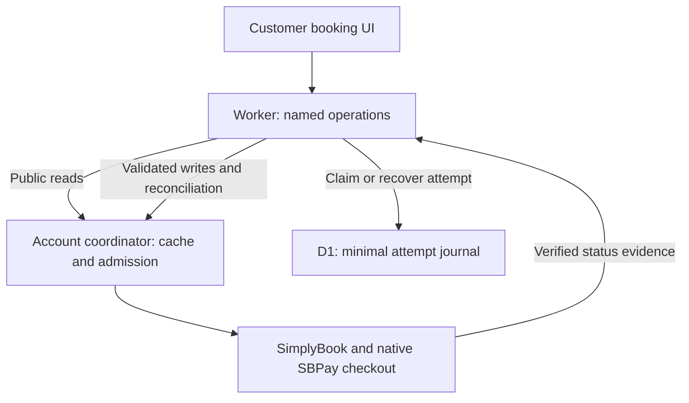
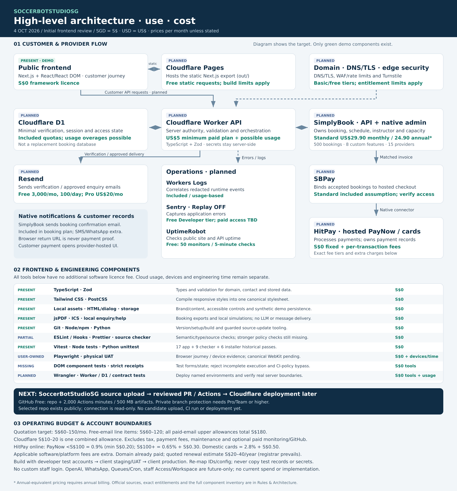

# SoccerBotStudio — Rules & Architecture

Canonical current contract. `SERVICE_CONTRACTS.md` owns service inputs, results, errors, authority and demo/live availability. `SOCCERBOT_JOURNEY.md` owns chronology, audits and receipts. These are the three canonical documents; README, AGENTS, diagrams and generated receipts orient or provide evidence.

Project/package name: **SoccerBotStudioSG**; npm identifier: `soccerbotstudiosg`. Repository: [LimYouSheng/SoccerBotStudioSG](https://github.com/LimYouSheng/SoccerBotStudioSG). Current main is `0cea68168738c722d05be9d3580938b65a4860c7`, tree `61918e04933afd960358903a2aa152a0872c7024`, after YS merged naming PR #5. Main run `37485321460` passed verification and the existing Pages demo deployment. Main is observed protected with required `verify / frontend` from GitHub Actions. Baseline PR #4 preserved the uploaded Mac source but was merged without explicit user approval; Journey records that failure. The Cloud experiment stays on its separate unmerged branch. The app remains a frontend demo; live provider, Cloudflare production and physical-device acceptance are separate gates.

## Authority and current scope

The 4 October 2026 instruction removes staff login and refactors the supplied customer frontend into Next.js, React and Tailwind. The quotation ZIP is an architecture/stack reference only. Its prices, dates, acceptance terms, old staff deliverables and other commercial scope are not adopted as requirements for this work. The Fitfinity PDF and guarded installer establish engineering practices, not SoccerBot business rules or its backend platform.

Current implementation: TypeScript, React client components within statically exported Next.js App Router pages, Tailwind CSS, extracted local assets, typed domain rules, demo service adapters, Vitest, Playwright, source checks and CI configuration. Customer verification, availability, enquiries, chat and payments remain simulations. No external booking, charge, email or message is performed. No staff login, staff portal, staff credential constants, staff session storage, staff route, or staff API access is shipped. Customer email verification remains.

## Current work boundary and source precedence — 6 October 2026

- YS authorized refactoring the engineering documents for Codex Cloud and forwarding the reconciled local work to GitHub, referring to “Model Context Protocol Overview” and “Engineering Workflow Principles”. YS explicitly requested OneFitfinity's North Star/Ralph Markdown and, at 23:23 SGT, rechecking its current docs for standardization. The latest reviewed source is its PR #8 head `16eea945f9324b6f20610d0a0b98b1a1cb6014e9`, incorporating main `7970f65b5975a6554c46eb521c7ca118939e4bb9`; the initial `821005d50c764134865af8f00ae4aa561260b878` adaptation remains historical. At 23:11 SGT YS requested SoccerBot's experiment refreshed from latest main, its own PR and concrete Cloud setup steps.
- `NORTH_STAR.md` owns the bounded CLOUD-01 outcome/acceptance. `PROGRESS.md` owns the one current task ledger. `docs/CODEX_CLOUD.md` owns setup/cutover/commands and the adapted Ralph cycle. The three existing canonical documents retain product/engineering, service and historical authority. Supporting task files do not duplicate or supersede those invariants.
- Codex Cloud is being evaluated on a separate experimental feature branch after the existing Mac baseline is synchronized to main. Codex may prepare browsers, run Playwright and inspect internal previews/screenshots/traces for scoped work. Routine Cloud implementation and feature-PR publication do not require a Mac installer or user-run browser pass. This supersedes earlier installer-first, Mac-only and blanket assistant-browser restrictions for routine Cloud development; historical receipts and optional guarded local delivery remain intact. Local headed viewing is optional; YS/client still owns physical-device acceptance.
- The loop handles one ready task, focused verification, diagnosis, progress and checkpoint, stopping at acceptance, a blocker, its run budget or PR-ready. No unattended relaunch, standing agents or indefinite polling. Routine defects can be repaired autonomously; requirements, business rules, architecture, security and material-cost changes need YS's decision. Do not change acceptance to obtain green.
- The inspected Mac source is already present in main, followed by naming PR #5. Keep author-workspace and actual Mac identities distinct. Keep Cloud/North Star/Ralph changes on their own experimental feature PR, unmerged and outside the Mac baseline. Passing the experiment does not authorize adoption. Source/planning receipts are not application acceptance; the loop cannot directly push main, merge, enable auto-merge or deploy. Every later merge needs explicit user approval for that specific PR.
- Client SimplyBook access remains read-only. Existing direct API evidence is discovery, not authorization to create customers/bookings, cancel, charge or edit configuration. New source/runtime work does not acquire extra provider permissions from an MCP connection.
- This publication changes eight documentation files only; existing delivery tooling, application/runtime/assets/dependencies/workflow and application test inventories remain unchanged. It prepares the Cloud setup procedure; actual environment configuration and fresh-task proof remain C3. New preview hosting, provider writes and production adapters are outside this experiment.
- Latest direct user instructions override older process snapshots. The latest web quotation owns product/commercial scope. OneFitfinity supplies engineering practices, not AWS/PostgreSQL/Docker/Vite, backend gates, historical counts or business rules.

## Current product rules — latest quotation

`APP404-SBS-Q-WEB-001(3).pdf`, dated 4 October 2026, is the latest product-rule authority. It supersedes conflicting prototype and older quotation rules. Commercial and legal terms remain in the quotation, not independently rewritten here.

- A1: responsive Home and Studio pages using supplied branding/content/imagery and agreed hero; navigation/contact/Instagram, titles, metadata, sitemap and canonical URLs. Preview builds are noindex. Live canonical URLs/sitemap require the confirmed production domain at launch.
- A2: service/player/contact details, multiple sessions on the same or different dates, dates/times automatically determine each session’s instructor, review and policy acknowledgement.
- A3: verify email before prefilling only approved name and phone from SimplyBook; permit correction; resolve duplicate/shared-email matches safely; expiring single-use verification and rate limits. Current demo stores only name/phone for prefill. No real SimplyBook lookup or verified identity is claimed.
- A4: server validates prices, instructor eligibility and studio capacity. SimplyBook accepts/rejects bookings. Displayed selections are not reservations. Availability is rechecked when selection changes and again at checkout.
- A5: offer hosted payment only after every session is accepted and invoice association/amount matches. Partial failures cancel only newly created confirmed-unpaid bookings. Verify uncertain results before retrying and flag incomplete cleanup. These are mandatory future Worker/provider gates, not proved by frontend simulation.
- A6: supported SimplyBook/SBPay → HitPay hosted checkout for enabled PayNow/cards. Provider-authoritative success/pending/failure/expired/late/uncertain handling. Best-effort payment appearance within provider controls.
- A7: verified references, date/time, studio, instructor, amount/status, arrival instructions, downloadable booking summary/calendar and help link. Configure and test native confirmation emails during provider integration.
- One Singapore venue and one shared studio. Concurrency is one across all instructors. English and SGD. 40-minute sessions for 1–4 players, with one instructor per session and one shared studio. Different sessions in one booking may have different instructors. Starts every 50 minutes, reserving 10 minutes for exit/entry.
- The quotation includes setup for up to the stated four instructors and one native operating staff account, with no fixed application cap for additional approved trainers. Current client discovery returns three active providers: Faisal, Nabil and Caelan. Do not require a fourth for the current roster or create one to satisfy a demo fixture. Four preview records/three-hour blocks are simulation only. Submitted availability is not assigned duty: Caelan is preferred over Nabil where YS assigns overlapping availability. One assigned instructor must cover the full booked play interval, with the 10-minute studio changeover protected across instructors. No custom staff login is included.
- Excluded: bespoke admin console, membership integration, recurring charging, payroll, historical migration, replacement scheduling database, automatic return to a previous confirmation page, podcasts and package integrations. Enquiry choices can describe a requested arrangement without implementing such integrations.
- B1/Q7: full scoped automated tests and UAT must pass, including provider outcomes, verification, capacity, duplicates, uncertain writes, permissions and physical devices. Demonstrate alerts, recovery and rollback. Record failures and resolve them. Local frontend demo evidence does not satisfy final provider/UAT acceptance.
- B2: two 60-minute in-person training sessions, source/configuration, development notes, access/test records and OOM at handover; native refund guide/walkthrough keeps cancellation separate from refund. Native authorised staff execute refunds.

Demo price S$88, public contact details and media come from the supplied HTML. Current demo opening hours are 9am–9pm per YS’s latest instruction. The observed client company calendar also shows 09:00–21:00; final prices, player/intake mapping and booking enforcement still require provider proof. No contractual development fee is used as a session price.

## Target stack and ownership

| Layer                 | Target                                                               | Responsibility / status                                                                                                                                                                            |
| --------------------- | -------------------------------------------------------------------- | -------------------------------------------------------------------------------------------------------------------------------------------------------------------------------------------------- |
| Public UI             | TypeScript, React, Next.js App Router, Tailwind CSS                  | Implemented frontend demo. Semantic HTML, accessible controls and responsive layouts.                                                                                                              |
| Web hosting           | GitHub Pages demo; Cloudflare Pages production target                | `out/` export; GitHub demo verification/deployment passed; physical acceptance pending. Cloudflare/domains not provisioned. No Next.js API routes or Node server requirement in deployed frontend. |
| Network               | Client domain, Cloudflare DNS, TLS                                   | Future staging and production separation.                                                                                                                                                          |
| API                   | TypeScript Cloudflare Workers                                        | Future explicit endpoints and orchestration. No arbitrary provider-method proxy.                                                                                                                   |
| Contracts             | Zod                                                                  | Frontend models validated now. Worker request/response schemas and size/date/session limits required later. Validation does not confer authority.                                                  |
| Booking               | SimplyBook supported APIs + native admin                             | Future authority for availability, instructors, hours, capacity and confirmed bookings.                                                                                                            |
| Payment               | Supported SimplyBook/SBPay native HitPay connector                   | Future hosted PayNow/card checkout and authoritative status. Provider checkout may have different styling. No card entry in this demo.                                                             |
| Customer identity     | Expiring email verification, protected sessions, D1                  | Future single-use challenge, exact-email lookup and approved contact prefill. Browser fixtures never establish real identity.                                                                      |
| Email                 | Resend; SimplyBook native booking notifications                      | Resend delivers verification, Worker verifies it. Booking write success does not establish email delivery.                                                                                         |
| Security              | Turnstile, WAF, rate limits, Worker secrets                          | Future server verification, least privilege, separate environment credentials and bounded endpoints.                                                                                               |
| Operational data      | Cloudflare D1                                                        | Planned sole durable owner of verification/session/capability state and the minimal checkout/recovery journal selected in PERF-01. No provider booking-database clone.                             |
| Provider coordination | Cloudflare Durable Object per actual provider account/quota boundary | Planned admission, duplicate-read sharing, short-lived public cache, token refresh and invalidation. Control state only; D1 owns durable attempts.                                                 |
| Diagnostics           | Workers Logs, Sentry, UptimeRobot                                    | Future correlated/redacted logs, errors and external health checks. Session Replay disabled. No custom operations dashboard required.                                                              |
| Source / CI           | GitHub, GitHub Actions                                               | Locked dependencies, baseline main CI green; new candidate publication/CI pending.                                                                                                                 |
| Deployment            | Wrangler / Cloudflare tooling                                        | Future reviewed staging/production deployment, exact versions and rollback evidence.                                                                                                               |
| Testing               | Vitest, Worker runtime integration tests, Playwright, physical UAT   | Frontend tests now; Worker/provider tests later. Physical acceptance is separate.                                                                                                                  |

Older staff/AI architecture is retained for reference only, outside the latest web quotation. No reinstatement is authorised by this document. If later commissioned, staff identity uses named Google Workspace accounts with MFA through Cloudflare Access. Worker verification must check issuer, audience, signature, expiry and role/provider mapping. OpenAI Responses API with official TypeScript SDK proposes structured actions. Worker code authorises and executes supported actions. D1 stores actor/provider links, proposals, confirmation expiry, status and minimal audit/incident data. WhatsApp Business uses programmed menu routes with verified sender mapping. Queues, consumer Worker, dead-letter queue and Cron Triggers support accepted background jobs, reminders and safe read-back recovery. Refunds, financial/security settings and unsupported actions remain native-admin operations. No blind mutation replay. A future protected PWA keeps authenticated data online-only and separates its browser service worker from the backend Worker. No PWA or AI-backend implementation is claimed here.

## Source ownership

- `src/app`: static route definitions, metadata and the one global stylesheet. No business mutations.
- `src/components`: shared UI, public shell and arena presentation.
- `src/features/booking`: customer state, step screens and interaction orchestration.
- `src/features/enquiry`, `src/features/assistant`: enquiry and customer-assistant UI.
- `src/domain`: typed data, validation, dates, pricing and booking guards. No UI, storage or fetch imports.
- `src/services`: service contracts, demo adapters, browser persistence and exports. Screens use these interfaces. Future provider fetch/persistence belongs here or in the Worker, never scattered across screens.
- `src/content`: supplied media and attribution metadata. Binary assets live under `public/assets`.
- `scripts`, `tests`: source/tooling checks, static preview and automated evidence.

One canonical owner per responsibility. Edit it in place. Remove superseded logic. No V2/fixed copies, tracked backups, duplicate screen implementations, CSS override tails or workaround chains. No `innerHTML`, injected monolithic legacy scripts or global delegated event handlers. React owns rendering and lifecycle. Native links support direct navigation and browser history.

The enquiry form renders disabled controls in the static HTML and enables them only after React hydration attaches its handlers. Customers must not be able to enter controlled values that a later render discards. Preserve native required-field validation; test the server-rendered disabled state, hydration without replacement, retained input and preview submission. Do not mask readiness defects with browser-test sleeps or retries.

The studio assistant handles Escape while open even when a touch interaction leaves keyboard focus outside its panel. Closing restores focus to its launcher; close/unmount removes the temporary document handler. The latest contact-only booking requirement removes participant and guardian fields and their validation. Preserve the five Booking Contact fields and required contact/verified-email validation instead.

## Booking invariants

- One to four players, valid dated slots and no duplicates/overlaps. Slot changes invalidate acceptance and payment drafts.
- The service adapter revalidates the full snapshot before checkout; displaying a slot is not a hold.
- A payment attempt retains an immutable reviewed snapshot. Pending/checking/late/paid attempts prevent another payment or draft mutation.
- Only a verified demo service result produces a confirmation. Declined stays retryable. Pending remains pending until a status check. Late payment remains under review and never auto-confirms.
- Demo payment checks last five seconds, survive reload with the original deadline, use a stable attempt ID and reserve assigned resources only once. Repeated polling must not create a second booking. Adverse outcomes remain covered through service and browser storage fixtures, with no customer-facing Preview controls.
- Contact and verified-email constraints run before payment. Only full name, email, mobile, preferred contact method and optional academy/school/organisation are collected. Participant, guardian/emergency, requirements and notes are removed from both UI and validation. Screens are not security boundaries.
- Calendar and booking PDF export use the confirmed snapshot and Singapore timezone, not mutable form fields.
- Demo storage is browser-only, versioned and schema-checked. Version 2 moves instructor/rotation metadata onto each session. Reading version 1 preserves the original stored source and existing attempt ID, deadline, paid receipt and studio allocation; writes use version 2. Its contents have no production authority. Use synthetic data. No provider credentials or actual financial data are collected.
- Production must verify customer session capability, authoritative provider status and booking/invoice association. Browser IDs, return URLs and AI output never prove identity, ownership or payment.
- Partial multi-session failure, stale state, duplicate submission, ambiguous provider response, safe cancellation of confirmed-unpaid records, expiry and late payment require actual provider-account integration evidence before launch.

## Booking oracle and instructor preview — 4 October follow-up

The presentation oracle is `showcase(2).html`, SHA-256 `9dec73897cdddb0a46b4cc401f5a9fe4cef55b73d254aff564f07a8af65b81c2`. Loader/footer share its exact dark SVG, SHA-256 `e1fb2d17fd4c37a601e68505a85467229234d6247df4fce0a99d0bd0291d14b4`; the header retains its light asset. All four existing Roboto files match the oracle bytes. Restore styles in the canonical stylesheet and React owners. Contextual icon dimensions must take effect. The summary cover uses the original local image through the base-path asset owner. Do not restore legacy script execution, staff features, two studios or early instructor choice.

40-minute sessions keep a 50-minute start cadence. Hours are 09:00–21:00; each complete session must finish by closing. The last valid start is 19:50, ending 20:30. Demo starting blocks are Faisal 09:00–12:00, Daniel 12:00–15:00, Instructor 3 15:00–18:00 and Instructor 4 18:00–21:00. The starting instructor stays for the entire session. Crossings are allowed: 11:30–12:10 and 14:50–15:30 show the rotation time and instructor continuity on the slot and in basket, review, payment and confirmation summaries. Ending exactly at a boundary does not cross it. These are simulation rules, not live staffing evidence.

Each available slot shows its instructor. Selecting sessions automatically stores each session’s starting instructor and optional rotation disclaimer. One booking may combine instructors across the same or different dates. There is no second instructor selection. Unique expanded instructor cards accumulate below the right-side Continue action; removing sessions updates that collection. Continue becomes available when at least one valid available session is selected. Changes invalidate policy acceptance. Checkout independently revalidates each instructor/rotation assignment and shared capacity.

The 5 October automatic-assignment instruction supersedes the earlier radio and About disclosure. Instructor cards are expanded informational articles, not controls. Preserve normal native actions for actual controls; never force clicks to conceal blocked input. Computed fractional CSS sizes may serialize differently across engines; compare the intended pixel size numerically with a tight rounding tolerance.

The session product card contains the fixed 40-minute duration. Player selection occupies the full content width. Leave booking presents equal-width sentence-case actions: Back to home on the left, Stay on the right. Your Details contains only Booking Contact. Confirmation exposes all content in order: Client Details → Session Details → Location → Amount → Disclaimers. Contact, session assignment, location and paid total each have one owner on that screen; no collapsed detail sections. The first site visit prompts for the official existing Player App (`https://soccerbot360.com/en/player-app`), with a persistent dismissal and a public navbar Download app link. This is an external app link, not a new PWA.

Static asset/style comparison and non-browser tests do not establish browser or physical visual acceptance. The user-run installer includes the complete declared browser scope automatically. Publication, new CI, deployment and provider acceptance remain separate gates.

## Central colour and typography contract — 5 October

`src/app/globals.css` is the only stylesheet and token owner. The existing main-header colour is `--color-brand: #050a2f`; navy/action/action-border alias it. Functional buttons, selected dates/times, progress, instructor headers, loader progress, links and status icons use that family. Hover is `#202957`; light selected/support surfaces use `#eef0f7` and `#dce1f1`. White foregrounds belong on dark blue; dark-blue text belongs on pale surfaces. Success/error/warning colours communicate their stated status only. Arena illumination keeps its explicit decorative accent and supplied logos/images remain unchanged.

Roboto stays local. Inspection of the actual WOFF2 tables confirms static normal 400, 500 and 700 and italic 900. Do not advertise static faces as weight ranges or rely on unavailable heavy normal faces. Italic 900 is reserved for page/marketing display headlines. Section/card headings, controls and body text are upright. Public marketing compositions retain their explicit display sizing; this exception does not apply to booking information or controls.

| Role                                         | Desktop / tablet | Phone (≤700px) | Weight / treatment                |
| -------------------------------------------- | ---------------- | -------------- | --------------------------------- |
| Booking page title, payment and status title | 40px             | 32px           | 900 italic, uppercase             |
| Dialog title                                 | 24px             | 24px           | 700 upright                       |
| Section / product / summary heading          | 20px             | 20px           | 700 upright                       |
| Card / instructor / subsection heading       | 18px             | 18px           | 700 upright                       |
| Body / input / primary action                | 16px             | 16px           | 400 body, 500 control, 700 action |
| Field label / supporting copy / disclaimer   | 14px             | 14px           | 700 label, 400 supporting text    |
| Compact progress / weekday / eyebrow         | 12px             | 12px           | Metadata only                     |
| Total amount                                 | 24px             | 24px           | 700, tabular numerals             |
| Payment amount                               | 32px             | 32px           | 700, tabular numerals             |

Heading line height is 1.25, body/support 1.6 and controls 1.4. Standard text controls are at least 52px; icon targets are 44px. Multi-line action cards can be taller while retaining the shared type size. Buttons use consistent upright sentence case. Default panels use 24px padding (20px on phones), sections 24px separation, and fields 20px gaps. Review sections use h2 and instructor subheadings h3 under their labelled region. Confirmation remains expanded in its accepted order; phone contact labels stack over values for readable long details.

The semantic palette is checked at text contrast ≥4.5:1 and focus/control boundaries ≥3:1. This is a defined colour-pair calculation, not a claim of complete WCAG or physical-device certification. The source gate calls `scripts/check-design.mjs`; negative fixtures reject teal action drift, weak contrast, tiny text, collapsed hierarchy, local booking colour/size bypasses, invented font ranges, undersized controls and missing/cyclic tokens. Browser coverage checks computed colour/type and overflow through all booking steps on the declared three projects. Cloud browser verification and YS/client physical visual acceptance remain separate.

## Low-latency booking architecture and acceptance plan — 5 October 2026

Status: selected design for M2–M9, not implemented infrastructure or measured performance. YS requested this plan at 08:43 SGT after accepting the presentation update. The current application has only demo adapters. Exploratory direct-Mac B1 reads are now measured in the register below. All end-to-end P01–P12 release results remain **NOT MEASURED**; direct API latency is not browser-to-Worker acceptance. These are internal engineering targets, not amendments to quotation price, dates, scope, warranty or SLA. M2.5 freezes provider-dependent budgets from evidence; failure requires a recorded design/entitlement decision with YS, never silent relaxation.

### PERF-01 — Constraints and canonical ownership

- Preserve one shared studio across instructors, 40-minute sessions, 50-minute starts, 09:00–21:00 hours, mixed-instructor carts and the accepted rotation disclosure. Prove live staffing coverage for the full session. Do not fabricate availability from the demo rotation. One to four players consumes one studio session; prove the provider quantity/intake-field mapping rather than passing player count as resource quantity.
- The official API reference lists common-server limits of 5,000 requests/day, two simultaneous requests and five requests/second [L1]. Treat them as provisional account constraints until M2.1 confirms quota scope, reset rule, all API families, other integrations and commercial entitlements. Count authentication, reads, writes, retries, callbacks requiring read-back and cleanup.
- `getCartesianStartTimeMatrix` documents provider-separated starts across a date range [L1]. Evaluate it first. Method presence does not prove account permission, room/resource filtering, rotation coverage or the native payment route. `batchId` or JSON-RPC packaging must not be treated as an atomic multi-date booking guarantee.
- Keep static UI/assets on Pages and same-origin, explicit customer operations on a Worker. A server-only SimplyBook adapter owns provider mappings, error parsing and outbound transport. No arbitrary method proxy or browser credentials.
- Add one Durable Object coordinator for each distinct provider quota/account boundary: admission, duplicate-read sharing, short-lived public data, token refresh and invalidation generations. Environments must use separate provider accounts; if an account is deliberately shared, its outbound quota must still have one governor while data remains partitioned. Never shard by visitor/date to evade the limit. Durable Objects provide globally addressable coordination [L3].
- D1 remains the sole durable owner of identity/capabilities and the minimal checkout/recovery journal: immutable request hash, state/version, provider references, per-write outcome and recovery lease. The coordinator stores only quota/cooldown/invalidation control state and expendable caches, not another booking ledger. SimplyBook and SBPay/HitPay remain scheduling/payment authorities. No new Redis, replacement booking database or paid plan is commissioned by this document.
- The coordinator is the only outbound admission path, including auth, recovery and callback read-back. The checkout orchestrator owns workflow decisions; the transport does not invent retry safety. D1 transactions cannot include remote calls, and single-threaded coordination does not make a read/await/write sequence atomic. Use durable claims and version checks before I/O and fenced completion after it. Choose concrete files at M3.1; these role names are not invented existing modules.

### PERF-02 — Critical request paths

1. Enter booking: render static content immediately; load route code and public catalogue while the customer uses the account/session steps. Availability prefetch begins only after booking intent and enough service/player context. Do not fetch for every home-page visitor or prefetch the whole year.
2. Calendar: one bounded browser request returns normalized slots plus instructor display data or a catalogue version reference already loaded. Compare 1-, 7- and 31-day provider queries at M2.2, then fix canonical range keys. Prefer the smallest range that supports the visible UI economically. The calendar must distinguish unknown days from genuinely unavailable days.
3. Selection: update the basket/cards immediately. Coalesce superseded rapid changes and validate the latest cart revision server-side, including selected dates outside the visible range. Continue is enabled only for that valid revision. A previous validation or cache snapshot grants no hold. Back navigation reuses still-valid data; edits invalidate earlier acceptance.
4. Checkout: one browser submission claims/reuses the durable attempt, validates trusted identity/time/price/instructor/resource data, creates all sessions through proved operations and verifies the complete invoice/amount association. Offer payment only after all stages succeed. Independent reads may overlap within the global limit. Writes stay ordered unless M2 demonstrates safe independence, association and compensation.
5. Payment: keep the approved native SimplyBook → SBPay → HitPay route. Reuse the original protected attempt on return/reload. Verified callbacks wake reconciliation when supported; otherwise use the proved status read. Customer polling reads our protected journal and does not automatically trigger another upstream call. No five-second artificial delay in the future live adapter; the existing demo simulation remains unchanged.
6. Confirmation: read one protected verified snapshot for the existing nonduplicated detail order and exports. No separate provider request per card/field. A successful browser return, cached calendar or missing callback cannot establish payment.

`TimeStep` currently calls synchronous demo availability during render. M3.2/M4.2 must introduce one asynchronous query owner behind the service boundary, with in-flight sharing, lifecycle cleanup and request/revision correlation. Do not turn that render-time call into network I/O or duplicate fetching in instructor/summary components. Cancelling a UI subscription does not cancel a provider write or imply a shared read has stopped upstream. Preserve native navigation, approved loader/hero timing and reduced motion. Measure decorative time separately AND include it in user-visible entry time; never hide it from reports. Start data work during the animation without changing accepted presentation in this planning task.

### PERF-03 — Cache, freshness and invalidation

Initial settings are explicit experiment inputs, to be fixed at M2.5/M4.1. Cache only allowlisted normalized public fields; strip provider email, phone, internal notes and tokens. Personal data, identity challenges, checkout results and payment/confirmation HTTP responses use protected access and `no-store`.

| Data                        | Initial policy                                                                  | Authority and invalidation                                                                                                 |
| --------------------------- | ------------------------------------------------------------------------------- | -------------------------------------------------------------------------------------------------------------------------- |
| Versioned assets            | Long-lived immutable CDN cache                                                  | New content gets a new URL; HTML/deploy references are versioned separately                                                |
| Public catalogue            | 5 minutes fresh, bounded to 15 minutes for visibly refreshing display only      | Configuration generation changes invalidate; price/eligibility rechecked at checkout                                       |
| Availability                | 15 seconds fresh from provider observation; no selectable stale-if-error result | Demand-driven refresh; expired content may remain visibly marked checking but cannot enable progression                    |
| Latest selection validation | One result for exact session/cart revision                                      | Bypass display cache when revalidating; reuse only the same concurrent validated query with suitable post-edit observation |
| Checkout validation         | Fresh reads after attempt claim, plus authoritative acceptance of each write    | Never reuse a browser validation token as authority                                                                        |
| Payment/confirmation        | Protected journal, latest verified evidence/version                             | Status scheduling shared per attempt; terminal success requires correct provider association                               |

Cache key: environment/account + logical service/provider/resource set + normalized date range + capacity-relevant player/options mapping + Singapore timezone + configuration generation. Include every factor affecting the result, normalize ordering, and bound ranges/key cardinality. Do not use customer identity in a shared public key. Retain original `observedAt`, `expiresAt` and generation across every layer; a cache hit or browser reload must not restart freshness. Never combine fragments of incompatible generations. “Fresh” means within the display policy, not proof that nobody booked since observation.

The coordinator owns the live availability cache initially. Use CDN caching for assets/public catalogue; avoid an additional independently stale availability cache until measurements justify it. Cloudflare Cache API data is local to a data centre, and its `cache.put`/`match` methods do not implement stale-while-revalidate directives [L4]. Do not assume a local purge is global or a header alone implements refresh.

Before dispatching a capacity-affecting write, mark affected ranges as changing and advance their generation. On known result, invalidate again and refresh on demand. A pre-write in-flight read cannot repopulate the new generation. Unknown writes quarantine the affected selection pending reconciliation; do not mislabel it booked/free. Our own invalidation cannot observe every native-admin/widget booking, so expiry, verified events where available and final provider acceptance remain mandatory. Treat unauthenticated callbacks as bounded hints only, never payment or availability authority. Test lost, repeated and out-of-order events. Empty-success responses may be cached within the same short policy; errors, malformed payloads and throttles must never become empty availability.

### PERF-04 — Admission, quota and failure behaviour

- Begin with at most two in-flight outbound calls and four starts in any rolling second, below the documented five-per-second ceiling. All entry points share the same governor. One token refresh serves concurrent waiters, uses the correct API family and credential generation, and counts against quota. The public guide describes a one-hour access token [L2]; establish the actual chosen auth expiry rather than applying this blindly to every token type.
- Dispatch ready work in this order: unresolved/financial reconciliation, admitted checkout, current selection validation, visible calendar read, speculative prefetch. Apply fair scheduling within a class and a bounded wait/deadline; do not let background work starve customers or financial recovery. Already-dispatched I/O cannot be preempted. Drop obsolete prefetch first.
- For the provisional 5,000/day account, initial app operating budget is 3,000 calls per rolling 24 hours: up to 1,800 browse/catalogue, 900 checkout/reconciliation/auth, and 300 integration diagnostics. Preserve 2,000 headroom for other consumers/provider uncertainty. The 900 is reserved capacity, not permission to abandon reconciliation after exhaustion. Stop optional traffic early, alert and contain new checkout when essential-work capacity is endangered. Actual other integrations may require a smaller app budget; freeze allocations/reset semantics at M2.1/M2.5.
- Record physical provider dispatches, not just browser requests. Forecast `catalogue/auth + cold range refreshes + selection validations + per-cart writes/invoice reads + status/recovery + other integrations`. Include peak-hour and daily traffic assumptions. Four instructor calls every 15 seconds over 12 hours would be 11,520 calls; even one combined call on that schedule is 2,880 before checkout. Therefore use demand-driven refresh, never constant opening-hours polling.
- Persist quota reservations/cooldowns before dispatch. Restart/eviction must not reset the budget or forget unresolved attempts. In-memory caches can be discarded safely. Test simultaneous entry, awaited I/O interleaving, restart during dispatch and permit release. A transport timeout does not prove the provider stopped processing; use a conservative recovery/cooldown policy and preserve unknown outcome, never immediately replay a write.
- Honour provider throttle signals, including JSON-RPC errors in HTTP-success envelopes, and Retry-After when supplied. Use operation-specific absolute deadlines and limited read retry with jitter inside the same budget; at most one automatic safe-read retry initially. Do not multiply retries across browser, Worker and adapter. Never hedge or automatically replay booking/payment mutations after an ambiguous response.
- Initial customer read deadline is 5 seconds including queueing; initial checkout foreground deadline is 15 seconds, both provisional until M2.5. These are containment deadlines, not performance targets or proof of cancellation. On expiry show checking/unavailable accurately and retain the original attempt. Background recovery runs through a durable due-work schedule/lease, not a promise depending on an open browser or `waitUntil` alone. If that scheduler is unavailable, retain unresolved state and alert; never falsely fail/pay again.
- For pending payment, initial upstream checks no faster than 5, 10, 20 then 30 seconds while actively awaiting an outcome, with jitter, quota protection and the proved payment expiry window. Share checks across tabs. Hidden-tab UI polling pauses; essential server reconciliation continues on its durable schedule. Terminal states stop routine polling. Provider callbacks may reduce delay but are not assumed reliable or supported until M2.3/M2.4.

### PERF-05 — Baseline measurement protocol

Use the same instrumented safe implementation for baseline and optimized comparisons. Disable only the read-cache/prefetch optimization under test in isolated staging; never disable authorization, shared capacity, admission, journal recovery or payment verification to make a faster baseline. The demo is a UI baseline only and its five-second simulation cannot stand in for provider latency.

| Baseline               | Where / when                                            | Required evidence                                                                                                                          |
| ---------------------- | ------------------------------------------------------- | ------------------------------------------------------------------------------------------------------------------------------------------ |
| B0 presentation        | Accepted static candidate, M1.4 / M3.2                  | Direct route and navigation timings, hydration, interaction and decorative delay separately; Cloud/CI browser execution                    |
| B1 provider capability | Developer test account, M2.1–M2.4                       | Exact API family/permissions, read shapes, 1/7/31-day range sizes, all instructors/resource rules, auth, errors, per-operation round trips |
| B2 safe uncached path  | Cloudflare staging, M3/M4                               | Browser → Worker → coordinator → provider, cold/warm token and process cohorts; no per-render network calls                                |
| B3 optimized path      | Same revision/configuration and workload, M4/M5         | Cache hit/miss, shared reads, prefetch usefulness, total calls/journey, queue time and complete checkout critical path                     |
| B4 client release      | Client account/mappings and root-domain artifact, M6/M7 | Repeat provider correctness and end-to-end targets; developer results do not transfer automatically                                        |
| B5 production          | M8.3 / M9.1                                             | Low-volume read smoke and passive metrics; any real booking/charge separately authorized; first operating-week comparison                  |

Measurement rules:

- Declare fixture/account mode, source candidate, config generation, tested artifact, API/method, query range, cart size, cache/token/process state, browser/device, Singapore origin/network and provider time window before running. Keep warm hits, misses, token refresh and service restart in separate cohorts; do not average away the slow path. Include one-session, three-session mixed-instructor/multi-date and approved-maximum-cart cases. The demo's 100-slot schema bound is not the live limit.
- Start with 10 exploratory samples per API shape to reject unsuitable methods, within a written call budget. For read latency acceptance use at least 200 observations per required cohort across at least three time windows. Run each cached/baseline pair with the same fixtures and alternating order. Cap real-provider benchmarking initially at 300 calls/day within the diagnostics allocation, spread work across days or explicitly rebudget; never exceed provider/account capacity for a load test.
- Write/payment tests use synthetic data and the supported native test route. Plan 20 journeys per approved cart-size cohort across three windows, count every session against the actual booking allowance, and reserve quota for cleanup/read-back. This small sample cannot establish a reliable production p95: require every pilot journey to meet its provisional threshold, label tail estimates provisional, then gather sufficient passive observations. If the account cannot support the planned sample, record insufficient evidence and resolve the test entitlement/scope with YS; do not inflate results by replaying mocks.
- Exercise 1, 5 and 20 concurrent browser clients against controlled provider doubles for 10 minutes per workload, including mixed dates and a same-key burst. Match realistic arrival rates and include a saturated phase proving backpressure. Never send that synthetic pressure unapproved to SimplyBook. Repeat a quota-safe authorized staging concurrency smoke, including two customers competing for one studio and a native-admin competing booking.
- Measure in-browser intent-to-paint and request-to-result using monotonic clocks; server spans use their own monotonic clocks. Correlate them with opaque trace IDs, not cross-machine timestamp subtraction. Record queue wait, auth, provider round trip, D1 time, normalization, response bytes, render time, cache age and actual upstream calls. For overlapping spans report the actual critical path, not a sum of percentiles. Queueing belongs in end-to-end latency.
- Record all attempts and outcomes, timeout/error/throttle/conflict rates, p50/p95/max and sample size. Use nearest-rank percentiles consistently. Show p99 only with at least 1,000 relevant observations and still report sample uncertainty. A timeout contributes its elapsed deadline and failure count; fast failures do not satisfy the successful-path gate. Do not discard the first cold run, rerun only failures or pool mobile/desktop/cache states to obtain a pass.
- Frontend lab profile: desktop Chromium, phone WebKit and tablet WebKit; record exact engines. Include a fixed Singapore-oriented constrained profile of 100 ms added RTT and 10/2 Mbps bandwidth, with CPU/device details fixed and recorded. Physical Safari/Chrome checks remain distinct and user-owned. Final device/network assumptions are confirmed at M2.5. Codex Cloud/CI may execute the browser profile; physical checks remain YS-owned. Approved direct provider measurements are a separate cohort.
- Keep redacted machine-readable samples plus the rollup and logs; never tokens, customer contacts or full provider payloads. Initial raw performance evidence retention is 30 days with longer aggregate release records, subject to reviewed operational retention. Correlation IDs/attempt references remain access-controlled. No Session Replay.

### PERF-06 — Target and acceptance register

All actual columns start **NOT MEASURED**. Release targets below are initial internal gates; best targets are stretch goals and cannot justify extra unsafe work. Provider-dependent rows are provisional until M2.5. After freeze, a missed gate blocks acceptance until repaired or YS explicitly reviews a documented changed requirement. This is not a provider response-time guarantee.

| ID / measurement boundary                                                               | Initial release target                                                                   | Best target                       | Gate / evidence                                                                                                             |
| --------------------------------------------------------------------------------------- | ---------------------------------------------------------------------------------------- | --------------------------------- | --------------------------------------------------------------------------------------------------------------------------- |
| P01 selected slot → basket/card painted, no network wait                                | p95 ≤100 ms                                                                              | ≤50 ms                            | App-owned; UI samples on each agreed profile                                                                                |
| P02 browser request → fresh cached availability received                                | p95 ≤300 ms                                                                              | ≤150 ms                           | App-owned warm path; zero upstream calls per valid hit                                                                      |
| P03 browser request → uncached visible availability received, valid token               | p95 ≤1,500 ms                                                                            | ≤800 ms                           | Provider-dependent; queue included; separate token-cold cohort                                                              |
| P04 latest cart edit → matching validation complete                                     | p95 ≤1,500 ms                                                                            | ≤800 ms                           | Provider-dependent; old revisions never enable Continue                                                                     |
| P05 Pay/checkout submit → verified hosted-checkout URL ready, one session               | p95 ≤4,000 ms                                                                            | ≤2,000 ms                         | Provider-dependent; all writes/invoice association included; customer payment-entry time excluded                           |
| P06 same boundary, three sessions across instructors/dates                              | p95 ≤7,000 ms                                                                            | ≤4,000 ms                         | Provider-dependent; approved maximum-cart budget fixed separately at M2.5                                                   |
| P07 verified payment evidence durably recorded → active customer's confirmation painted | p95 ≤1,000 ms                                                                            | ≤500 ms                           | App-owned delivery budget; instrument journal-to-client propagation; define push or bounded journal polling at M5.3         |
| P08 valid callback received → authoritative status reconciled durably                   | p95 ≤2,000 ms                                                                            | ≤1,000 ms                         | Conditional on supported callback/read-back; otherwise use measured bounded polling detection lag; no pretend callback pass |
| P09 direct page loads / normal interactions                                             | p75 LCP ≤2.5 s, INP ≤200 ms, CLS ≤0.1                                                    | ≤1.8 s / ≤100 ms / ≤0.05          | Standard Web Vitals boundaries [L5]; lab is prelaunch evidence, field verdict pending sufficient traffic                    |
| P10 same-key 20-client cold-read burst                                                  | Exactly one upstream read per required provider query                                    | Same; no extra call               | Deterministic coordinator gate; fallback query count explicitly declared                                                    |
| P11 quota/admission                                                                     | ≤2 active, ≤4 starts/rolling second, persistent budget within allocation                 | Lower calls with same correctness | Every physical dispatch counted; restarts/auth/faults included                                                              |
| P12 integrity under every fault scenario                                                | Zero duplicate effects, overselling, false paid confirmations or unrelated data exposure | Zero                              | Hard gate independent of latency; each required scenario passes                                                             |

P07 begins after authoritative evidence is available to our system; separately measure provider settlement → callback/status visibility → our verification so provider delay cannot disappear. Measure provider-hosted page load and customer return separately from P05/P06. Preserve existing branded entry duration in a separate total-entry result. For P03–P06, show the measured provider critical path and our added overhead; budget our server work excluding provider I/O/queue initially at p95 ≤150 ms (best ≤75 ms). Choose coordinator placement by measured full Singapore-user path, not assumed provider geography. Worker placement and Durable Object placement are separate controls; do not assume enabling one relocates the other.

Correctness is a zero-failure gate for the scoped test set, not a claim of mathematical impossibility. Minimum pilot write samples use the stricter all-samples-within-threshold rule in PERF-05 and retain provisional statistical status. Read cohorts require the specified sample count. Missing samples, unavailable methods or failed target rows stay pending/blocked, never N/A merely to obtain green. A callback row is N/A only when M2.5 records that polling is the selected supported design and substitutes an explicit detection-lag target.

Results row schema: metric ID; baseline and candidate identities; environment/account mode; config/method/cart/device/network/cache cohort; window; n; p50/p95/p99 eligibility/max; success/failure/timeout/conflict counts; upstream calls; cache age/hit/shared-read rates; total and component timings; release/best target; delta; pass/fail/pending; raw evidence reference; reviewer and date. Compare absolute gates first, then relative improvement. A cache-hit percentage alone is workload-dependent and is not an acceptance shortcut. Desired zero user-visible throttles under the frozen normal workload is recorded separately from saturation tests where bounded refusal is expected.

### PERF-07 — Required experiments, recovery and operations

Before optimization freeze, prove: cold duplicate reads coalesce; different keys respect admission; token expiry produces one refresh; old responses cannot update newer carts; a pre-write response cannot resurrect a free slot; cache/config generations partition correctly; native-admin changes are detected within the display policy; provider acceptance prevents conflicts; one shared studio cannot be booked through different instructors concurrently; retry/reload has one attempt; unknown create survives process loss; partial cleanup touches only newly created confirmed-unpaid records; delayed/duplicate/missing callbacks and late payment preserve the correct state. Test both provider contracts and our transport faults; deliberately lost responses are faults, not proof the provider failed.

Benchmark range size and cache TTL first, then placement and bounded independent reads. Introduce each optimization with the same safety suite and one-variable comparison. Do not add permanent high-frequency polling, speculative writes, unsafe multi-session parallelism or new infrastructure merely for an unmeasured benefit. Freeze the maximum live cart from provider semantics and measured latency/quota, not the demo's 100-slot allowance. If mandatory dependencies alone exceed P05/P06, report the measured floor and review supported batching/entitlements/cart policy with YS; do not weaken booking-before-payment or substitute independent HitPay checkout.

M6 monitoring must distinguish queue delay, provider time, local processing, cache age, quota remaining, error class and unresolved attempt age. Initial alerts: forecast app-budget exhaustion; any normal-load throttle; sustained p95 violation over a 15-minute window with at least 20 samples; any duplicate/false-paid/oversell signal; recovery overdue relative to its frozen deadline. At low volume show individual slow/error events rather than a misleading stable p95. Test the alert destination in staging. A provider incident disables prefetch and unsafe new writes as needed while retaining protected status/recovery. Cache bypass is a bounded incident control routed through the same governor, not a fleet-wide cache flush or provider flood. Roll back code/config compatibly, preserve attempts and reconcile external effects.

M9.1 compares the first operating week with B4 by cohort, call cost and recovery outcomes. Revisit TTL/budget only from evidence, preserving accepted targets and provider authority. Ongoing monitoring follows the existing warranty/optional-maintenance terms, not a new 24/7 commitment. Numerical latency gates and the evidence register belong here; operation schemas belong in Service Contracts; actual runs, changed decisions and failures belong in Journey.

### Performance sources and limits of evidence

Official sources reviewed 5 October 2026. Subsequent 6 October read-only evidence is recorded below; untested entitlements and writes remain open:

- [L1 SimplyBook API reference: limits, matrix methods and booking parameters](https://simplybook.me/en/api/developer-api/ref)
- [L2 SimplyBook public User API guide: authentication](https://help.simplybook.me/wiki/User_API_guide)
- [L3 Cloudflare Durable Objects: coordination model](https://developers.cloudflare.com/durable-objects/concepts/what-are-durable-objects/)
- [L4 Cloudflare Cache API: data-centre scope and unsupported stale directives](https://developers.cloudflare.com/workers/runtime-apis/cache/)
- [L5 Google Web Vitals: LCP, INP, CLS and 75th-percentile assessment](https://web.dev/articles/vitals)
- [L6 Cloudflare Durable Objects pricing](https://developers.cloudflare.com/durable-objects/platform/pricing/) and [placement](https://developers.cloudflare.com/durable-objects/reference/data-location/)

## B1 provider evidence register — 6 October 2026

User-run client diagnostics exercised `soccerbotstudio` at `https://user-api.simplybook.asia/`. Catalogue service is Kickoff Special, observed ID 2, duration 40; active public providers are Faisal 2, Nabil 3 and Caelan 4. Singapore timezone/+480 and account timeframe 10 minutes were read successfully. These IDs are observations, not production mappings. No application adapter or Cloud backend is live.

Corrected scheduling receipt `SoccerBotStudioSG_SimplyBook_Client_ReadOnly_2026-10-06.2a18sdlh.json` completed 44/44 calls without retries. The exploratory matrix measurements cover all three public providers, resource count 1 and ten samples per range:

| Provider date range | Successful samples | Nearest-rank p50 | Maximum (= exploratory p95 at n=10) |
| ------------------- | ------------------ | ---------------- | ----------------------------------- |
| 1 day               | 10/10              | 125.29 ms        | 171.20 ms                           |
| 7 days              | 10/10              | 309.54 ms        | 345.75 ms                           |
| 31 days             | 10/10              | 858.10 ms        | 960.93 ms                           |

Measurement boundary is request dispatch through read/decode/validation on YS's machine, excluding the separately reported local admission delay. Connection reuse is allowed; upstream cache state is unknown. This is one exploratory window, not a statistically accepted tail or browser → Worker measurement. Retain the prior runs and all outcomes. PERF-05 sample requirements and every P01–P12 end-to-end gate remain unchanged and unaccepted.

Design direction supported by this evidence: prioritize the visible selected day, reuse sufficiently fresh data and demand-load wider windows in the background. A 31-day response near 961 ms must not become a required blocking dependency for each calendar click. Freeze query/range/cache policy only after the full path and quota tradeoff are measured; no performance improvement is claimed from documentation alone.

Latest boundary R2 receipt `SoccerBotStudioSG_SimplyBook_Boundaries_ReadOnly_R2_2026-10-06.huben1se.json` completed 51/51 calls, including 36 bounded end-time cases and before/after matrices. Both snapshots had 268 offered starts, with no off-grid starts, closing violations, pairs less than 50 minutes apart, overlapping calendar envelopes or insufficient 40-minute envelope coverage. Sixteen sampled offered starts all returned 50-minute provider intervals. Twenty-one additional generated boundary cases were omitted explicitly, not passed.

Ten absent starts returned end datetimes and ten absent starts returned null. `calculateEndTime` is therefore not an availability validator. Null remains unresolved, never bookable. Service duration plus the supplied buffer screenshot and valid intervals are consistent with 40-minute play +10-minute changeover, but actual contention/booking enforcement remains pending. Exact result semantics belong in Service Contracts; immutable receipt and artifact hashes belong in Journey.

Caelan's 19 October configured working start was corrected to 14:00 and offered starts follow 14:00, 14:50 onward. YS's actual availability input was 13:40; this does not make 13:40 an approved grid start. Submitted Nabil availability is not proof of assigned duty. Demo four-provider/three-hour rotations are not client configuration requirements.

Do not rerun these diagnostics merely to migrate development. Preserve read-only client authorization. Remaining M2 gates cover entitlements/quota, price/player/intake and resource mapping, breaks where configured, synthetic customer matching, controlled booking/changeover contention, native payment and uncertain-write recovery. Both M2.1 and M2.2 remain incomplete. Local diagnostic quota accounting is only per Mac/account, not an account-wide governor; other devices/integrations are excluded.

## Development process — latest OneFitfinity adaptation

### Change and documentation ownership

1. Inspect the requirement, current canonical rule, actual source and every affected write path. Identify the baseline using an inventory/fingerprint and, once Git exists, repository/branch/HEAD/index. Preserve unknown edits; do not reset, stash or change expected hashes to bypass a mismatch.
2. Make one bounded change in its owner, with meaningful regressions for changed behaviour. Remove superseded implementations. Split by responsibility, not arbitrary file length. Keep composition, domain, service adapters, feature UI, controlled drafts and shared navigation/modal ownership distinct.
3. Maintain three documentation owners: current invariants and architecture here; named service operations, actual signatures, results, errors, principal derivation, permissions, idempotency/version rules and availability in `SERVICE_CONTRACTS.md`; dated reasons, failures, repairs, fingerprints and evidence in Journey. Machine contracts and pictures are supporting artefacts, not competing rules.
4. New live interfaces use named request records, a closed operation catalogue and adapter/server-derived authority. A browser-supplied role, provider ID or hidden control cannot grant permission. The current positional synchronous demo interfaces are documented as such; their existence does not mean a live endpoint exists.
5. Unsupported live operations fail explicitly or remain unavailable. No silent fallback to browser mocks, simulated success, or unrelated success-shaped records. A feature visible in the UI is not proof its API has been implemented.

### Data, security and alternate paths

6. Enforce invariant consistency across create/edit/retry/refresh/recovery and any future admin paths. Recheck trusted time, session, relationship, resource eligibility, price and capacity at the server write boundary. Prevent duplicate effects and stale writes. Correlate async replies to the current session/attempt so an old callback cannot overwrite newer state.
7. Distinguish not attempted, committed, rejected and unknown external outcomes. Preserve the original attempt identity on an ambiguous retry and reconcile before another write. Cancellation is not refund; app rollback does not reverse provider bookings/payments, revoke delivered email or recall downloaded/shared files.
8. Store only minimal operational state in D1; SimplyBook and SBPay/HitPay remain authoritative. Use typed schema and reviewed additive migrations; do not rewrite applied migrations. Expand, backfill/verify and switch compatible readers/writers before contraction. Test upgrades on representative populated state. Destructive downgrade/restore is a separate reviewed operation. Run migrations deliberately with separate permissions, not on every Worker request/startup.
9. Keep secrets in backend-only environment stores; never in `NEXT_PUBLIC_*`, frontend bundles, source, installer payloads, screenshots or fixtures. Use synthetic data, minimal returned fields, redacted diagnostics and restricted retention. Verified email permits approved name/phone prefill, not unrestricted customer-record access.

### Verification requirements and honest evidence

10. Declare selected local versus complete milestone scope before running checks. Small repairs use explicitly affected code and Cloud browser checks where behaviour is affected; full applicable PR/main gates remain required before claiming integrated acceptance. The current Cloud authorization above supersedes historical user-only execution wording. A docs-only change needs source/doc integrity and change-boundary evidence, not a new application/browser run.
11. Maintain domain/service regressions and React component/form/state/navigation tests (Vitest plus an appropriate DOM harness). Tests use explicit clocks for time-sensitive rules. Worker-runtime, D1 migrations/concurrency, authorization, provider-contract and fault-recovery tests are added when those owners exist. Controlled HTTP fixtures and provider doubles are labelled; they do not prove real provider acceptance.
12. Use semantic ESLint and Hooks rules with zero warnings/errors, strict types, scoped globals and narrow justified exceptions. Prevent inline suppression of required lint rules. Use `npm ci` with the reviewed lockfile for initial setup, deliberate dependency changes and CI. Routine local repairs check and reuse installed pinned dependencies; missing/drifting setup stops before source writes. Tools directly imported by custom verifiers must be direct dependencies. Tool/config/lock changes need their own regression evidence.
13. Source health must cover portable case-insensitive file AND parent-directory collisions, path safety, supported syntax, static/dynamic imports, unused bindings, graph cycles/reachability, layer boundaries, canonical CSS import/ownership, conflict markers, whitespace and test controls. CSS parsing should reject duplicate declarations and undefined variables and validate supported property/value syntax; Tailwind/custom syntax needs deliberate handling. Parsing and reachability cannot certify every path, dynamic style or security rule.
14. Test the verification system with isolated invalid fixtures: syntax/import/dead-module/layer/cycle/case/symlink failures; CSS and semantic/Hooks errors; forbidden suppression; workflow/lock mutations; incomplete/malformed receipts. The first draft has only a subset, recorded in Journey. Never borrow Fitfinity's test counts as SoccerBot acceptance counts.
    Case-collision fixtures must exercise the same production path checker using logical path inventories, including parent directories and Unicode normalization. Do not depend on creating two case-only filename variants on disk; a case-insensitive filesystem merges them. Keep filesystem traversal and other source checks covered separately, with no platform skips.
15. Compare expected discovered inventory with actual executed file/case/project identities and totals. Reject errors, failures, retries, skips, fixme/todo/only and truncated or missing results. Discovery is not execution. Do not inflate timeouts, reduce scope or weaken assertions to hide defects. A test-only repair preserves actions and assertions and is not an application fix.
16. Applicable verification sequence: source/baseline → tooling regressions → semantic lint/types → unit/component/service → production export → Cloud/CI browser matrix → final source/diff/receipt review. Add Worker/schema/infrastructure gates when implemented. The existing `npm run verify` includes browsers and is authorized in the configured Cloud workspace. PWA/OS-sharing/camera gates apply only if such features enter scope; do not import Fitfinity's three Vite builds or PWA requirements into this static Next.js site.
17. Retain per-case output, readable stacks, exact commands and exits, expected/actual counts, browser engine/projects, logs/artifact paths and candidate identity. Pipelines preserve nonzero exits (`set -euo pipefail` where used). Stop at failed required gates and retain the first failure and corrective explanation. Never clear storage or restore old source merely to hide a defect. Historical unchanged-source evidence must be labelled as reused.
18. Treat implemented, selected locally checked, full local verified, full CI passed, merged, deployed, provider-accepted and physical-device accepted as separate states. User-reported acceptance without inspectable receipts stays user-reported. Device emulation is not a physical phone; a download event is not proof of readable PDF contents or saved/shared delivery.

### GitHub, release and handover

19. After initial repository bootstrap, use feature branches and reviewed PRs to protected main. Required verification must cover every PR/main change, without path-filter bypasses, optional required jobs, masked failures or deploy credentials in PR jobs. Test the parsed workflow policy. CI configuration alone does not prove branch protection or successful runs. Private-repository protection has a plan requirement (cost inventory below).
20. Publishing source, merging and deploying are distinct authorized actions. Verification remains read-only with respect to deployment credentials. Cloudflare CD must consume the exact reviewed green artifact, use named environments and scoped credentials, validate account/project/bindings/domain, serialize stateful changes and retain deployment/rollback receipts. GitHub Pages is now explicitly authorized for the developer demo by the later 4 October instruction. Future Cloudflare production hosting remains unchanged; no AWS infrastructure is introduced.
21. Match security/dependency checks to the exact lockfile and release artifact. No vulnerability acceptance is implied by lint or unit tests. If a container is introduced later, its digest/scan is a separate gate; containers and image registries are not required for this Worker/static architecture.
22. At milestones audit duplicated responsibilities, oversized owners, dead code/CSS, stale async state, every business write path, query/bundle cost, authorization, configuration drift, recovery and documentation drift. Passing tests do not close an untested finding. Prioritize behavioural/security issues; avoid arbitrary test-count or file-size targets.
23. Handover records source revision/fingerprint, three doc owners, actual commands/tool versions, environment/account owners and delegated roles, secret references (never values), artifact/deploy/migration identity, verified alerts/recovery/UAT and open findings. Monitoring, cost alerts, restore drills and dashboards require implementation and evidence; their mention does not mean they exist.

## Development accounts and client cutover

This guidance comes from “Build With Own Accounts”, reconciled with the current web scope. No GitHub owner or deployment-ownership decision was made in that retrieved exchange. Client ownership/delegated access is the architecture/handover target; the user subsequently selected `LimYouSheng/SoccerBotStudioSG` in this conversation. Client handover/ownership arrangements remain separate from that developer-owned target.

| Environment           | Account/data boundary                                                                                                           | Acceptance boundary                                                                                                                         |
| --------------------- | ------------------------------------------------------------------------------------------------------------------------------- | ------------------------------------------------------------------------------------------------------------------------------------------- |
| Local demo now        | Browser fixtures, synthetic contacts and simulated payment; no credentials                                                      | UI/domain behaviour only; no email, booking or funds move                                                                                   |
| Developer integration | Developer SimplyBook test company, HitPay sandbox, separate Cloudflare/D1/Resend test resources                                 | Verify the actual native SimplyBook → SBPay → HitPay sandbox route and enabled features; developer funds/real customer records are not used |
| Client staging/UAT    | Client-controlled configuration and supported test credentials; explicit test recipients                                        | Repeat entitlement, ID mapping, resource capacity, verification and checkout/recovery acceptance on client settings                         |
| Client production     | Client merchant/KYC, billing, domains, verified email sender and production secrets; developer delegated least-privilege access | Go-live only after client-account UAT, authoritative payment verification, monitoring and cutover evidence                                  |

Rules for portability and cutover:

- Keep the same application/service boundary. Resolve logical service, instructor, shared resource, location, form-field and notification identifiers through validated per-environment mappings. Do not hardcode developer company/provider IDs in screens or business rules. The current named demo IDs are fixtures, not live account mappings.
- Keep SimplyBook company/API credentials, SBPay/HitPay merchant mode and keys, supported callback endpoints/signing secrets, Worker bindings, D1 database, allowed origins/return URLs, Resend sender and Turnstile configuration separate. Nonsecret configuration is not interchangeable with secrets; validate the complete environment before enabling writes.
- Recreate and compare durations/buffers, opening hours/timezone, 1–4-player service/price, instructor eligibility, one-studio capacity, Multiple Bookings, required API/payment features, intake fields and notification templates. IDs and account entitlements differ. Do not treat a credential swap as migration completion.
- Use the native SBPay/HitPay connector. Do not add an independent HitPay checkout creator that bypasses the accepted booking/invoice association. Where authenticated webhooks are actually supported for our integration boundary, verify signature/replay/merchant/environment; otherwise use the supported authoritative status lookup. Browser return URLs never establish payment success.
- Test duplicate callbacks, stale prices/slots, partial multi-booking failure, lost responses, unknown writes, pending/expired/late payments and incomplete cleanup. Confirm all new sessions and invoice association before offering payment. Sandbox success does not establish live PayNow/cards activation or client KYC.
- Before UAT: provision client entitlements, populate reviewed ID mappings, rotate/install client secrets, verify DNS/TLS/sender/callback configuration, and repeat the scoped acceptance suite. Record ownership/billing/delegation and rollback references. Keep sandbox bookings, customers and invoices out of production; historical migration is excluded.
- At cutover: reconcile or stop in-flight test attempts, keep old account references with their originating environment, deploy the verified client configuration and record the result. Old transactions remain in their original provider account. Revoke obsolete developer/test access after handover as appropriate.
- No percentage-complete promise is adopted from the earlier assistant's rough estimate. Live-account limitations are explicit gates. Client account creation, paid upgrades and production changes have not been performed by this review.

## Architecture picture and component costs

Editable picture: `architecture/SoccerBotStudio_Architecture.svg`. The picture is a dated summary predating the 5 October provider coordinator and minimal attempt-journal decision; PERF-01 and this table own the updated architecture. It is not a deployment receipt. Components marked planned are not installed/provisioned merely because they appear here. Prices checked 4 October 2026; USD and SGD are deliberately not silently converted. Free means within the provider's applicable limits, not unlimited support or free engineering work.

| Component                                                       | One-line use                                                        | Current state                                                                           | Cost basis / month unless stated                                                                                                                                            |
| --------------------------------------------------------------- | ------------------------------------------------------------------- | --------------------------------------------------------------------------------------- | --------------------------------------------------------------------------------------------------------------------------------------------------------------------------- |
| Next.js + React + React DOM                                     | Route and render public pages and the booking journey               | Implemented demo                                                                        | S$0 framework licence                                                                                                                                                       |
| TypeScript                                                      | Check types across UI/domain/contracts                              | Implemented                                                                             | S$0 tooling licence                                                                                                                                                         |
| Tailwind CSS + PostCSS                                          | Compile responsive styles in one canonical stylesheet               | Implemented                                                                             | S$0 tooling licence                                                                                                                                                         |
| Zod                                                             | Validate drafts, contact and storage shapes; future HTTP boundaries | Frontend only                                                                           | S$0 library licence                                                                                                                                                         |
| Local assets, native HTML/dialog, browser storage               | Present content and retain synthetic demo state                     | Implemented; storage is not production authority                                        | S$0 extra service fee                                                                                                                                                       |
| jsPDF + native ICS export                                       | Generate customer booking summary and calendar files                | Implemented preview exports                                                             | S$0 library/service fee                                                                                                                                                     |
| Local enquiry / FAQ assistant                                   | Simulate enquiry validation and deterministic help                  | Demo only, no model or delivery                                                         | S$0 service usage                                                                                                                                                           |
| Cloudflare Pages                                                | Serve the Next.js static export                                     | Export exists; hosting planned                                                          | Free static requests within project/build limits [P2]                                                                                                                       |
| Domain + DNS/TLS                                                | Resolve and secure the customer site                                | Production domain unconfigured                                                          | Existing domain paid; quoted S$20–40/year renewal estimate, actual registrar price prevails; basic Cloudflare DNS/TLS in platform allowance                                 |
| Cloudflare Workers                                              | Enforce authority and orchestrate supported provider calls          | Planned                                                                                 | Workers Paid minimum US$5; request/CPU overages possible [P1]                                                                                                               |
| Cloudflare D1                                                   | Minimal identity/capability and checkout/recovery journal           | Planned                                                                                 | Included quotas with Workers; read/write/storage usage must be measured [P3]. No second scheduling database.                                                                |
| Cloudflare Durable Objects                                      | One coordinator per actual provider account/quota boundary          | Selected design, not provisioned                                                        | Requests, duration and storage under the selected Workers/DO plan [L6]. Reconcile measured use within the Cloudflare allowance; no paid upgrade or fixed extra fee assumed. |
| Worker secrets + Zod server schemas                             | Keep credentials server-side and bound allowed requests             | Planned                                                                                 | No separate library fee; included runtime/usage basis                                                                                                                       |
| Turnstile                                                       | Challenge abuse and verify tokens server-side                       | Planned                                                                                 | Free plan within limits [P4]                                                                                                                                                |
| WAF / endpoint rate limiting                                    | Restrict abusive traffic and verification attempts                  | Planned                                                                                 | Basic platform allowance; exact rule entitlement/paid upgrades must be checked, Workers Paid does not buy every WAF feature                                                 |
| SimplyBook APIs + native admin                                  | Authoritative bookings, hours, instructors and shared capacity      | Planned                                                                                 | Standard US$29.90 monthly or US$24.90/month annual; 500 bookings, 8 features, 15 providers. Quoted allowance S$50–100 [P5]                                                  |
| SBPay native HitPay connector                                   | Associate accepted bookings/invoice with hosted checkout            | Planned                                                                                 | Quotation assumes SBPay Standard included; verify required checkout/API access. Payments PRO is on SimplyBook Premium (US$59.90 monthly / US$49.90 annual-equivalent) [P5]  |
| HitPay hosted PayNow/cards                                      | Process money and provide authoritative payment records             | Planned                                                                                 | S$0 fixed; online domestic cards 2.8% + S$0.50. PayNow below S$100: 0.9%, min S$0.20; S$100+: 0.65% + S$0.30. Applicable software/platform fees extra [P6]                  |
| Resend                                                          | Deliver email verification and any approved enquiry delivery        | Planned                                                                                 | Free 3,000 emails/month, 100/day; Pro US$20 for 50,000/month, overages extra. Quoted paid allowance S$30–60 [P7]                                                            |
| SimplyBook native email                                         | Send booking confirmation/reminders                                 | Planned                                                                                 | Included in booking plan; SMS/WhatsApp credits excluded [P5]                                                                                                                |
| Workers Logs                                                    | Correlate redacted operational events                               | Planned                                                                                 | Included allowance / usage charging under Cloudflare budget [P1]                                                                                                            |
| Sentry                                                          | Capture application errors with Session Replay disabled             | Planned reference stack                                                                 | Free Developer tier exists [P8]; team access/quotas may require paid plan, price to confirm (pricing page unreadable in this review)                                        |
| UptimeRobot                                                     | Externally check site/API availability                              | Planned reference stack                                                                 | Free 50 monitors at 5-minute checks; faster/team tiers extra. Free commercial use permitted [P9]                                                                            |
| GitHub repository                                               | Version source, review PRs and retain history                       | Initial source merged; require protected main                                           | Free private repo; enforced private branch protection needs Pro/Team or higher. Team listed US$4/user/month with offer terms [P10, P11]                                     |
| GitHub Actions                                                  | Run locked verification and retain evidence                         | Baseline workflow passed; revised candidate CI pending                                  | Free tier allowance 2,000 minutes and 500 MB artifacts; excess/runner pricing applies [P12]                                                                                 |
| Git + Node/npm + Python                                         | Version, install/build and run guarded tooling                      | Node 24.19.0/npm 11.9.0 baseline; Git and Python 3.11+                                  | S$0 tooling licence; hardware/CI time separate                                                                                                                              |
| ESLint + Next/Hooks rules + Prettier                            | Check semantics and format source                                   | Present; further hardening pending                                                      | S$0 tooling licence                                                                                                                                                         |
| Vitest + Node test runner                                       | Check domain/services and source-checker regressions                | Unit/component and checker suites; current receipts in Journey                          | S$0 tooling licence                                                                                                                                                         |
| Python unittest / guarded update fixtures                       | Check apply-only update safety                                      | Hardened operator and negative fixtures; receipts in Journey                            | S$0 tooling licence                                                                                                                                                         |
| Playwright + physical UAT                                       | Verify browser journeys and real-device behaviour                   | Configured; Cloud/CI runs, physical checks separate                                     | S$0 Playwright licence; device/lab/labour costs separate                                                                                                                    |
| DOM component harness / strict receipts / workflow policy tests | Cover UI state and verify that required tests actually ran          | Implemented DOM harness, receipts and parsed workflow checks; browser execution pending | Open-source tools possible; S$0 licence, implementation effort separate                                                                                                     |
| Wrangler + Worker runtime/contract/D1 tests                     | Deploy named environments and verify actual server boundaries       | Missing, later integration work                                                         | S$0 CLI/test-tool licence; Cloudflare runtime charges above                                                                                                                 |

The quotation's planning target remains **S$60–150/month**, excluding payment fees, tax, domain renewal and maintenance. This is a planning target, not a computed maximum: the listed upper allowances with paid email sum to **S$180/month** (100 + 20 + 60), before optional paid monitoring/GitHub plans. Free-email allowances sum to S$60–120. Reconcile the chosen entitlements/quotas before committing a final operating budget. Cloudflare S$10–20 is one combined allowance, not a separate charge for every subcomponent. Developer test subscriptions may temporarily add costs while client accounts are also active.

Payment fees apply per transaction/order, not automatically per session. For a single S$88 preview order, published base fees imply about S$0.79 PayNow or S$2.96 domestic card, before provider rounding, tax and extra fees. HitPay lists 0.2% for some software products; do not assume its applicability or absence on the native SBPay route without merchant/provider confirmation. Standard payment collection and Payments PRO/payment-link entitlements are different; prove the exact supported route before deciding a plan upgrade.

Future-only reference components: OpenAI Responses API, WhatsApp Business, Queues/consumer/DLQ/Cron, staff Cloudflare Access/Google Workspace MFA and richer AI action state are **not commissioned for the current web scope and add no current service spend**. If reauthorized, price them separately and verify identity, permissions, confirmation and recovery. Do not add PostgreSQL, AWS, Cognito, Docker or a second booking database merely because the handbook used them.

### Official cost references

- [P1 Cloudflare Workers/runtime/logs](https://developers.cloudflare.com/workers/platform/pricing/)
- [P2 Pages static requests](https://developers.cloudflare.com/pages/functions/pricing/)
- [P3 D1 pricing](https://developers.cloudflare.com/d1/platform/pricing/)
- [P4 Turnstile plans](https://developers.cloudflare.com/turnstile/plans/)
- [P5 SimplyBook plans](https://simplybook.me/en/pricing)
- [P6 HitPay Singapore fees](https://hitpayapp.com/sg/pricing)
- [P7 Resend plans](https://resend.com/pricing)
- [P8 Sentry free Developer plan](https://www.sentry.help/en/articles/13965037-can-i-set-up-an-on-demand-pay-as-you-go-budget-for-my-free-developer-plan)
- [P9 UptimeRobot plans](https://uptimerobot.com/pricing/) and [commercial-use clarification](https://help.uptimerobot.com/en/articles/11604710-who-should-use-uptimerobot-s-free-plan)
- [P10 GitHub branch protection eligibility](https://docs.github.com/en/repositories/configuring-branches-and-merges-in-your-repository/managing-protected-branches/about-protected-branches)
- [P11 GitHub plans](https://github.com/pricing)
- [P12 GitHub Actions allowances](https://docs.github.com/en/billing/concepts/product-billing/github-actions)

## Guarded local delivery — retained for transition and optional use

Routine Cloud development edits an isolated feature checkout and publishes a reviewed PR; it does not require a Mac installer per task. Local delivery still uses the canonical `scripts/build-local-installer.py`, `scripts/local-installer.py` and `scripts/guarded-update.py`, preserving the reviewed OneFitfinity operating pattern and SoccerBot's own implementation.

- One self-contained shell, Desktop repository default, explicit manifest scope, complete baseline/payload/revision/path validation before writes, one repository lock, external full-source backup/logs and Desktop JSON/failure ZIP. Preserve unknown edits and original failures; no reset/stash/automatic rollback or source-hash substitution.
- Validate exact branch/HEAD and capture/preserve the user's actual unstaged index. Source inventory includes tracked/untracked intended files. Refuse symlinks, case collisions, partial states, corrupt payloads, undeclared deletions and races. Resolve only installer-created temporary-directory OS aliases.
- Completed candidates rerun without source writes or Git-state/mtime changes, with fresh evidence for their declared checks. Lower-level source-only application is not full verification. The only generated-source exemption is the reviewed `next-env.d.ts` treatment; it does not exempt ordinary edits.
- Full application delivery selects the installed exact Node pin, checks lock-aligned packages, Chromium Headless Shell/WebKit paths and preview port before writes, then runs its declared complete code/browser gate with one fresh build. It performs no routine dependency downloads. Missing browser execution cannot produce a full pass.
- Bounded planning delivery uses Python/Git, document integrity and selected installer suites; it cannot change app source, assets, packages, lockfile or workflow. Its exact allowed supporting files are described below. It produces no full application/browser acceptance.
- Preserve immutable historical wrappers/receipts. A legacy publisher requiring a matching full local receipt keeps that contract. The new Cloud source-transfer workflow is explicitly distinct: a draft PR may receive verification in Cloud/CI, and cannot be accepted from a planning receipt alone.
- For publication, verify the complete intended candidate and actual source origin. If reusing a saved verifier receipt, recompute its fingerprint with the reviewed verifier algorithm in that original checkout; never compare it to the author's unrelated fingerprint. Read the R2 correction in Journey before changing publication tooling.
- Before linking, confirm persisted final bytes/content, exact filename/link/command and SHA-256. Keep download, candidate-map, verifier, Git and built-output identities distinct. No test/build is repeated merely to publish unchanged accepted source.

## Presentation fidelity and early tooling baseline

- Visual reference: `showcase(2).html`, SHA-256 `9dec73897cdddb0a46b4cc401f5a9fe4cef55b73d254aff564f07a8af65b81c2`. Reference HTML/CSS controls presentation. Latest quoted product rules still override older demo capacity, instructor and payment assumptions. Staff access remains removed.
- React owns the arena scene and transition lifecycle. Separate owners: `arena.tsx` idle interaction, `arena-facility.tsx` static panels, `arena-geometry.ts` projection calculations, `arena-entry.tsx` SVG rendering, `booking-navigation.tsx` route/loader orchestration and `brand-loading.tsx` shared loading artwork. Logo vector data has one content owner.
- The hero uses its measured source panels and pitch, 3,000ms entry, 900ms booking reveal, and click/Escape skip. Reduced motion bypasses the entry. Coarse pointers show the booking words directly. Native modifier/new-tab links remain native. Back navigation/unmount clears pending timers, animation frames and scroll locks.
- Home → Studio navigation and Home/Studio booking CTAs use the existing explicit branded transition (480ms minimum plus 180ms fade once the route arrives); static prefetch must not bypass it. The hero must never show this second loader. A framework fallback is supplementary, not the behaviour owner.
- Preserve the reference's white Home studio section, split proportions/image crops, dark offer/contact CTA, uppercase display type, full-width Studio booking CTA, light footer/contact grid and responsive breakpoints. The single stylesheet owns named reference presentation and Tailwind utilities; no copied legacy script or HTML injection is permitted.
- Runtime: Node 24.19.0 via `.nvmrc`, supported package range `>=24.19.0 <25`, matching Node 24 types and exact npm dependencies. `npm ci` consumes the lockfile. The canonical `typecheck` command runs `reset-next-types.mjs`, `next typegen`, then `tsc --noEmit`. Cleanup validates both fixed generated trees (`.next/types`, `.next/dev/types`) before removing either, refuses symlinks and preserves source, dependencies and other build/cache files. Verify fresh and dirty generated state, including duplicate filenames; do not weaken TypeScript or exclude conflicting files to hide a failure. Stop development/build processes before verification. `next-env.d.ts` is generated/ignored; the original tracked copy requires one explicit user index removal.
- Vitest has separate Node service/geometry and jsdom React component projects, including `.test.tsx`, Testing Library/user-event and DOM assertions. Zero retries/exclusive tests. Browser engines stay Chromium/WebKit; no Vite/PWA/AWS implementation is copied from Fitfinity.
- For date-dependent browser journeys, initialize an advancing clock with `page.clock.install({ time })`. Payment completion and verification expiry depend on `Date.now()` advancing alongside scheduled callbacks. Never freeze Date for these journeys. The pinned Playwright implementation emulates scheduling APIs too; do not describe this as native timers. A non-browser tooling regression evaluates the actual suite setup and pinned clock with the real demo booking adapter, covering deadline completion, every payment outcome, retry and pending recovery. Clock/setup changes must check affected time consumers before delivery. Streamed rendering can temporarily retain hidden content: the loader journey first requires the active main region's level-one heading, then retains its original global selectors and explicitly requires exactly one DOM match before clicking. Hidden duplicates count too; a sole hidden staged link must not satisfy page readiness. Preserve the destination, loader visibility, route arrival and transition cleanup assertions. Persistent duplicates must fail; do not use `.first()`, visibility filters, forced clicks, sleeps or longer timeouts to conceal them.
- `verify:code` runs source → policy → negative tooling fixtures → installer fixtures → formatting → lint → generated types → unit/component/service → exact unit receipt → production export. `verify:browser` builds current source, runs the canonical browser matrix and validates per-case/project identities and actual configured engine/retry metadata. Cloud or optional local execution; retain the actual environment in the receipt.
- Health checks enforce graph reachability/cycles/layers, portable paths, TypeScript parse diagnostics, canonical CSS import, parser-based CSS declarations/values/variables and unused named selectors, suppression/test controls, required reviewed inventory and package/lock/workflow policy. These static checks are not a proof of pixel fidelity or every dynamic behaviour.
- CI verification has commit-pinned Actions, read-only permissions, no path filtering/conditional required gates, Node pin, full non-browser/browser gates, timeout and always-retained artifacts. The policy checker deliberately rejects mutation fixtures. The workflow is named `Verify`; the internal job ID remains `frontend`, with the explicit status-check name `verify / frontend`. Require that exact check from GitHub Actions and PRs on main via account settings. After PR #5 merged, the branch endpoint confirms protected main with required `verify / frontend` from GitHub Actions. Preserve required checks, up-to-date branches and administrator enforcement; recheck actual settings before any later release. Source configuration alone cannot change repository protection. Passing CI or publishing a PR never authorizes its merge; explicit user approval is required.

## GitHub demo release contract

- Pages source must be **GitHub Actions**, not branch/Jekyll publishing. This account setting is separate from source. Never claim it changed without read-back evidence.
- `/SoccerBotStudioSG` is the default and CI-required build-time base path. The single `site-path.ts` owner prefixes native media and favicon; Next Link/router, including the hero, retain logical routes. Fonts are bundled from existing assets. Empty base path supports separately verified root hosting later.
- Required `verify / frontend` verification (internal job ID `frontend`) runs once with one build and the full candidate inventory (currently 43 unit/component cases and 42 browser executions). Preserve all browser actions/assertions and zero retries. Export checks verify routes/assets and bind the exact output files across browser execution.
- Main only uploads verified `out/`. `deploy` needs successful `frontend` and consumes the same-run artifact without another build/test pass. Only deployment receives Pages/OIDC write permissions. PRs cannot publish. Serialize main runs without cancelling an active deployment. Negative workflow fixtures enforce these rules.
- Local browser checks use the same prefix as CI. Assistant export/HTTP checks are non-browser evidence. Code, local browser, CI, merged, deployed and physical acceptance remain distinct.
- Candidate installers accept exact source/revision combinations. When branches share a tree, select by branch/HEAD before applying. Preserve idempotence, unknown-edit refusal, backups and receipts.

## Current acceptance and transition gate

Baseline PR #4 synchronized the exact uploaded Mac source and passed CI, but its merge lacked explicit user approval. This process failure remains recorded. YS subsequently merged the CI naming PR #5. Current main `0cea68168738c722d05be9d3580938b65a4860c7` contains those four naming/document changes on top of the inspected Mac baseline; do not claim its entire tree still equals the older Mac checkpoint. No new Mac synchronization is established.

Prepare CLOUD-01 from that latest main and preserve the inherited `verify / frontend` workflow. The experiment changes eight documents only and stays unmerged. Fresh Cloud setup, final-candidate CI and a usable candidate preview need their own evidence. Main protection and its required check are now observed; full M1.2 release-control acceptance, M1.3 advisory disposition and M1.4 physical/deployed visual acceptance remain separate gates. No M2 subiteration is closed solely from read-only discovery, and no repeat availability sample or client write is needed for this migration.

## Bounded planning delivery and identity safeguards

The existing `planning` scope permits AGENTS, the three canonical documents and the existing builder/runner/runner tests. It does not currently permit README, NORTH_STAR, PROGRESS or CODEX_CLOUD. The Cloud experiment is a separate docs-only feature PR, not a local planning-installer delivery; no allowlist expansion is included. Default application mode retains all browser gates. Unknown scope and out-of-scope changes reject.

Do not confuse artifact SHA-256, source candidate-map fingerprint, Git branch/HEAD/index, application verifier fingerprint or provider diagnostic identity. Preserve exact fetched bytes and actual Mac state; calculate download hashes only after final edits and verify final filename/link/command. Unknown or partial sources require reconciliation, never substitution with author-workspace hashes.

Existing planning validation and Python installer gates remain unchanged. Source checkpoints are read-only diagnostics with external receipts, not application/browser evidence. Final experiment checks cover Markdown formatting, relative links, fences, the 44 stable iteration headings and an exact docs-only diff. No provider request or repository mutation occurs in the Mac checkpoint.

## M1–M9 iteration plan — 4 October 2026

Stable IDs identify deliverable checkpoints, not equal-duration weeks. The latest quotation schedules commencement 5 October, development through 6 November, client testing 10–16 November and launch/handover 17–22 November 2026. Internal windows below are proposed planning windows within that schedule, conditional on provider proof, access and client readiness; they do not amend commercial terms. M2 feasibility gates live contract freeze. No later deadline permits weakened acceptance or unsupported API assumptions.

Every subiteration must declare scope and canonical owners, update affected contracts/rules and Journey, retain affected positive/negative checks, demonstrate its outcome and recovery, and record the exact accepted revision/artifact plus next resume point. Full applicable PR and main CI remain required; main verifies the merged revision independently. Each deployment consumes its environment's tested artifact without rebuilding. Cloud/CI browser and user physical-device evidence, real provider results, selected tests, CI and deployment remain separate. No mocks establish provider authority. All future items remain planned until their own evidence is recorded.

## M1 — Foundation closure and delivery safeguards

Target: 5–6 October 2026. State: Frontend baseline complete; closure pending. Scope: A1 and engineering process.

Outcome: Preserve the accepted frontend and close the process gaps before live integration.

Owners: AGENTS, three canonical docs, scripts and tests, workflow policy. Product changes only for confirmed defects.

### M1.1 — Reconcile the accepted baseline

Read the current checkout and remote. Record PR 3, main and deployed demo evidence. Replace stale pending status in canonical owners and record this roadmap there.

Exit evidence: Exact branch/HEAD/index and source inventory recorded; documentation diff contains no product drift.

Depends on: Current handoff and actual checkout.

### M1.2 — Enforce the reviewed release path

Configure and read back PR and required-check protection for main. Preserve PR/main verification and main-only artifact deployment.

Exit evidence: Repository settings and parsed workflow negatives prove bypasses are rejected. Green CI alone is insufficient.

Depends on: M1.1 and account permissions.

### M1.3 — Close tooling and delivery findings

Review current dependency advisories. Carry forward exact installer/R2 identity checks, final-file/link checks and portable refusal fixtures. Extend canonical tooling only where a gap is demonstrated.

Exit evidence: Known apply, no-write rerun, unknown/partial refusal, original-checkout fingerprint and wrong-file rejection are evidenced. Advisory findings have a recorded disposition.

Depends on: M1.1; exact retained examples.

### M1.4 — Accept the deployed demo visually

YS checks Home, Studio, hero, ordinary CTA loaders, booking routes and responsive layout on the deployed revision. Record existing behaviour as the visual baseline.

Performance addition: record B0 direct-load, ordinary booking/Studio entry and hero/skip/reduced-motion timings on the accepted static artifact. Include the actual decorative delay in total user-visible time; it is not a SimplyBook measurement.

Exit evidence: Actual deployed URL/revision and desktop/phone/tablet observations retained. Fix regressions in the owner without weakening tests.

Depends on: M1.1 and deployed demo.

Recovery and demonstration: Preserve the accepted source and receipts. Unknown checkout or incomplete evidence stops the update before writes. Retain the milestone demonstration and apply the common completion gates to every item.

## M2 — Provider feasibility and account configuration

Target: 5–9 October 2026. State: Read-only discovery partially evidenced; remaining gates block live contract freeze. Scope: A2–A7 and complimentary setup.

Outcome: Prove the provider path before building the application around assumptions.

Owners: Provider configuration, environment mapping, Service Contracts and Journey. No new production adapter implied.

### M2.1 — Account readiness and temporary setup

Inventory developer/client accounts and entitlements, test-mode availability, merchant activation and access owners. Include the quoted complimentary setup of the existing temporary SimplyBook account through 22 November.

Performance addition: confirm actual API families, token expiry, quota/reset scope, other consumers, daily call and monthly booking allowances, supported synthetic-test route and benchmark budget. Record baseline status and approved device/network/load assumptions; no account upgrade is implicit.

Exit evidence: Read-back setup record, no secret values, and a clear separation of temporary operating, developer test and client production accounts.

Depends on: Client access and approved configuration.

### M2.2 — Prove scheduling and shared capacity

Verify one studio, the currently approved three-provider roster, 40-minute play and 50-minute starts; additional quoted trainer setup remains available when required. Verify prices, hours, forms, eligibility and multiple same/different-date bookings.

Performance addition: collect B1 read measurements for 1/7/31-day matrix queries with all instructors; prove the combined method covers shared studio, buffer/rotation boundaries and quantity mapping. Record p50/p95 eligibility, payload bytes and call count, plus competing native-admin booking evidence.

Exit evidence: Two competing bookings across different instructors cannot occupy the shared studio. Buffer boundaries and native administration agree.

Depends on: M2.1 and approved prices/hours.

### M2.3 — Prove the native hosted payment route

Trace accepted bookings to the correct invoice and supported SBPay/HitPay checkout. Verify exact API/plan access, PayNow/cards activation and supported payment-status reads.

Performance addition: trace and time every sequential dependency from complete session acceptance to invoice association and hosted-checkout URL, for one/three/maximum proposed sessions. Measure hosted page/return separately; verify actual callback/status support and the safe polling alternative.

Exit evidence: Retain a synthetic booking/invoice/amount/status trace for every required operation. Public integration documentation alone does not close this gate.

Depends on: M2.1; supported test route.

### M2.4 — Prove failure and recovery semantics

Establish provider behaviour for partial session creation, lost responses, cancellation, payment expiry and late settlement. Verify native refund steps and notification timing.

Performance addition: measure throttle/error/timeout behaviour, token refresh, write-after-lost-response reconciliation, callback delay and unpaid-only cleanup. Prove a provider error is never treated as no availability and unknown writes are never blindly replayed.

Exit evidence: Known, rejected and unknown results remain distinguishable. Document safe unpaid-only compensation and cases requiring native staff review.

Depends on: M2.2 and M2.3.

### M2.5 — Freeze the integration contract and mappings

Record supported operations, errors, safe retry/reconciliation rules and logical-to-provider ID mappings for each environment. Decide minimum durable attempt state.

Performance addition: freeze PERF-01–PERF-07 values, logical contracts, query range, TTL, quota allocation, timeout/recovery schedule, final live cart cap, provider call graph and P01–P12 acceptance register. Provider-dependent targets require B1 evidence and an explicit decision on any measured floor above target. Select the minimal D1 journal and coordinator design before implementation. Missing proof remains a blocker.

Exit evidence: Capability matrix has evidence or an explicit blocker per operation. Re-estimate dependent work if proof is incomplete by 9 October.

Depends on: M2.2–M2.4.

Recovery and demonstration: Use synthetic records and supported test modes. Reconcile test writes before cleanup. If a required operation is unsupported, record the blocker and revise the affected plan with YS. Retain the milestone demonstration and apply the common completion gates to every item.

## M3 — Server foundation and customer identity

Target: 12–16 October 2026. State: Planned. Scope: A3 and shared security foundations.

Outcome: Create a protected API boundary that preserves the existing presentation and supports guest and returning customers.

Owners: New Worker/HTTP and D1 owners chosen explicitly; src/services contracts/transport; booking orchestration and identity UI.

### M3.1 — Worker and environment foundation

Add validated configuration, explicit endpoints, backend-only secrets, bounded requests, allowed origins, safe errors and correlation IDs. Establish isolated Worker/D1 test execution.

Performance addition: introduce the single account coordinator and outbound governor, with persistent quota/cooldown state and protected token handling. Instrument queue/provider/storage spans and verify restart/await interleaving/admission under controlled concurrency. Compare full-path placement only after measurement.

Exit evidence: Missing/wrong account bindings fail closed. Secrets do not appear in browser bundles or logs. Runtime/configuration negative tests pass.

Depends on: M1 closure and M2.5.

### M3.2 — Named asynchronous service contracts

Replace positional synchronous live assumptions with typed named requests, stable errors and explicit demo/live adapters. Preserve approved screens and ignore stale replies.

Performance addition: define the planned logical operations in Service Contracts, one asynchronous query owner, exact cache/revision keys, shared reads and stale-response rejection. Capture B2 safely uncached transport. Keep all provider fetching out of React render and repeated card effects.

Exit evidence: Contract and component tests cover delay, failure, reordered replies and unavailable live operations. No silent mock fallback.

Depends on: M3.1.

### M3.3 — Minimal durable state and migrations

Implement verification/session state and the reviewed minimal checkout/recovery ledger. Define uniqueness, expiry, retention and compatible migration sequencing.

Performance addition: implement the sole D1 attempt journal with durable claims/version fencing and a proved due-work scheduler. Restart/reload must recover unknown dispatched writes and cannot reset quota permits or duplicate effects. Coordinator cache/control storage must not become a second ledger.

Exit evidence: Populated-state upgrade and interrupted-operation tests pass. Provider scheduling/payment records are not cloned into a second authority.

Depends on: M3.1 and M2.5.

### M3.4 — Email challenge and abuse controls

Deliver verification through the approved sender. Use single-use expiring challenges, bounded attempts, rate limits and verified Turnstile where applicable.

Exit evidence: Wrong/expired/reused challenges and concurrent redemption reject. Enumeration and abuse tests pass. Authorized test recipient receives the actual email.

Depends on: M3.2–M3.3; sender setup.

### M3.5 — Protected sessions and guest checkout capability

Derive authority server-side. Define secure session/capability transport, expiry, revocation, origin/CSRF protection and safe guest attempt ownership.

Exit evidence: Forged browser storage, guessed attempt IDs, stale sessions and cross-customer reads fail. Logout/replacement-session races preserve the new identity.

Depends on: M3.3–M3.4.

### M3.6 — Safe returning customer prefill

Query approved name/phone only after verification. Handle zero, unique, duplicate and shared-email matches without exposing unrelated records; allow customer corrections.

Exit evidence: Provider-backed prefill cases and Cloud browser flow pass. Ambiguous matches require safe manual entry, not guessed identity.

Depends on: M3.2 and M3.5.

Recovery and demonstration: Keep live writes disabled until configuration and authority gates pass. Use compatible additive migrations and revoke invalid sessions without deleting unrelated records. Retain the milestone demonstration and apply the common completion gates to every item.

## M4 — Live availability and reliable booking creation

Target: 19–23 October 2026. State: Planned. Scope: A2 A4 A5.

Outcome: Let customers select real availability and create one recoverable multi-session attempt without overselling the studio.

Owners: Availability/provider adapters, date and booking domain, Worker orchestration, attempt ledger and booking UI.

### M4.1 — Authoritative availability and eligible instructors

Read mapped services, hours and instructor eligibility. Apply Singapore time, elapsed-slot rejection, closures, buffers and real shared capacity.

Performance addition: implement the selected range query, normalized public cache, original-age propagation and generation invalidation. Measure B3/P02/P03/P10/P11 and test cold bursts, expiry, provider failure, stale fill after mutation and native-admin changes.

Exit evidence: Same-day cutoff and date-boundary tests close the elapsed-slot finding. Cross-instructor resource conflicts match provider state.

Depends on: M2.5 and M3.2.

### M4.2 — Connect selection and server revalidation

Keep dates/times before instructor, multiple-date selection and 1–4 players. Revalidate on selection changes and at checkout; bound cart size using approved provider limits.

Performance addition: measure P01/P04 with instant selection feedback and server validation of the latest cart revision. Reuse valid data across routes and bound intent-based prefetch; record both visible latency and actual upstream calls per journey.

Exit evidence: Stale availability/price/instructor changes reject safely. Selection does not claim a reservation. Delayed responses cannot replace newer choices.

Depends on: M4.1 and approved cart limit.

### M4.3 — Create and recover a checkout attempt

Persist the reviewed immutable snapshot, authority, logical request identity and mapped environment before external writes. Define duplicate submission behaviour.

Performance addition: retain per-stage timing and provider dispatch counts for the claimed attempt. Duplicate submissions reuse it; unknown dispatch cannot be retried under a new key to appear faster.

Exit evidence: Double-click, parallel request, reload and timeout yield one logical attempt. Reusing a key with different data rejects.

Depends on: M3.3 M3.5 and M4.2.

### M4.4 — Create every selected session safely

Use proved provider operations, record each known booking result and validate resource acceptance. Reconcile ambiguous responses before any retry.

Performance addition: compare the measured critical path with P05/P06 using only proved safe parallelism. All accepted sessions and the matching invoice remain prerequisites; the performance target cannot justify partial payment readiness.

Exit evidence: Concurrent competing checkout and provider timeout tests show no blind duplicate creation or premature payment offer.

Depends on: M4.3 and M2.4.

### M4.5 — Handle partial failure and compensation

On partial failure cancel only this attempt’s newly created, positively confirmed-unpaid bookings. Recheck payment state and retain failed/unknown cleanup for staff review.

Performance addition: prioritize due financial/unknown recovery within the same governor, bracket every write with cache generation changes, and test delayed cleanup/payment races without re-exposing uncertain slots.

Exit evidence: Partial-create, cleanup-failure, late-payment race and lost-response cases preserve paid/unrelated records and report unresolved state.

Depends on: M4.4.

### M4.6 — Close booking recovery end to end

Exercise refresh/retry/expiry from each intermediate state, including server interruption. Demonstrate the exact next step for an unresolved attempt.

Performance addition: close the controlled 1/5/20-client workload, restart and saturation suite and the quota-safe provider pilot. Retain complete B2/B3 samples, slow/failing cases and P10–P12 outcomes; no provider load test is implied by mock concurrency.

Exit evidence: Worker/D1 and authorized-provider evidence plus Cloud/CI browser checks pass. Complete session and recovery references are retained.

Depends on: M4.3–M4.5.

Recovery and demonstration: Keep original attempt identities. Reconcile unknown writes before repeating. Stop payment on partial/uncertain booking and retain actionable cleanup evidence. Retain the milestone demonstration and apply the common completion gates to every item.

## M5 — Hosted payment and authoritative confirmation

Target: 26–30 October 2026. State: Planned. Scope: A5 A6 A7.

Outcome: Take payment through the proved native route and show success only when the provider records establish it.

Owners: Worker checkout/status handlers, native payment adapter, state model, protected confirmation service and payment UI.

### M5.1 — Validate invoice and checkout association

Offer hosted checkout only after all sessions are accepted and account, environment, currency, amount and booking/invoice associations match.

Performance addition: complete P05/P06 timing through verified checkout URL readiness and document the measured calls per one/three/maximum cart. Never substitute unrelated checkout to meet the target.

Exit evidence: Mismatched invoice, amount, environment or missing session cannot produce a checkout link. No independent bypass checkout.

Depends on: M4.6 and M2.3.

### M5.2 — Hosted payment and safe customer return

Launch the supported provider checkout and retain protected attempt correlation through cancel, reload and return navigation. Target approved appearance within provider controls.

Performance addition: live loading follows actual protected status with no demo five-second floor. Measure provider-hosted load and return separately; customer payment-entry/settlement time is visible in reports but not mislabelled app processing.

Exit evidence: PayNow/card paths that are enabled are exercised. Forged/tampered return parameters cannot confirm payment or expose another attempt.

Depends on: M5.1.

### M5.3 — Verify payment status

Implement authoritative status reads and authenticated callbacks only where supported. Bind results to merchant/environment, invoice, amount and attempt.

Performance addition: implement shared per-attempt reconciliation and protected journal delivery for P07/P08. Freeze a ≤1-second journal-to-active-UI mechanism or prove a better one; upstream polling remains separately bounded. Prove webhook authentication before trusting events, with a measured polling fallback if unsupported.

Exit evidence: Duplicate/out-of-order callbacks, tampering, lost callbacks and delayed status do not duplicate effects or regress final evidence.

Depends on: M5.1; proved status interface.

### M5.4 — Resolve pending expired late and unknown outcomes

Define transitions and customer messages for decline, pending, expiry, late payment and unknown results. Keep retry rights consistent with provider finality.

Performance addition: exercise every detection/timeout/recovery deadline, including absent callbacks, background browser tabs, quota pressure and process restart. Report external settlement visibility separately from local propagation.

Exit evidence: Each fault scenario has a retained receipt and safe next action. Paid-after-expiry or cleanup races go to reconciliation, never automatic false success.

Depends on: M5.2–M5.3.

### M5.5 — Protect the final confirmation

Read verified booking/session/instructor/payment details under the correct customer capability. Include amount/status, arrival guidance and help.

Exit evidence: Guest and verified-customer confirmations work after the supported return/refresh paths. Direct-ID and unrelated-record access reject.

Depends on: M5.3–M5.4.

Recovery and demonstration: An unknown payment remains unresolved. Never request another payment solely because a return page or callback is missing. Reconcile provider state and use authorized native administration when necessary. Retain the milestone demonstration and apply the common completion gates to every item.

## M6 — Complete the customer flow and release preparation

Target: 2–6 November 2026. State: Planned. Scope: A1 A7 B1 B2.

Outcome: Finish all scoped functionality, client configuration and operational rehearsals before formal UAT.

Owners: Exports/content/metadata, native notifications, client environment mapping, CI/CD, diagnostics and operational guides.

### M6.1 — Booking summary and calendar exports

Generate PDF and calendar from protected final records in Singapore time. Handle Unicode, long names, multiple sessions and pagination.

Exit evidence: Inspect actual downloaded contents and dates, not only download events. YS verifies phone save/open and calendar import.

Depends on: M5.5.

### M6.2 — Native emails and approved public content

Configure/test native confirmations and verify their timing. Finalize policies, instructor identities, contact/arrival details, metadata, sitemap and canonical domain. Decide the demo enquiry/help treatment within scope.

Exit evidence: Actual intended-recipient email and correct content are evidenced. No production enquiry claims delivery from demo-only success.

Depends on: M2.4 M5.5; approved client inputs.

### M6.3 — Client staging configuration and full rehearsal

Populate client-controlled mappings, test credentials, sender and callback/origin settings. Repeat capacity, identity, booking and payment acceptance on client settings.

Performance addition: repeat B4 on client account mappings, root hosting and production-like bindings. Confirm governor isolation, quota consumers and target rows; no automatic transfer of developer-account latency or entitlements.

Exit evidence: Client-account tests pass independently of developer sandbox results. No test customers/bookings or developer secrets migrate to production.

Depends on: M3–M5; client readiness.

### M6.4 — Production build and deployment pipeline

Prepare Cloudflare Pages/Workers, named environments, root-path configuration, scoped deployment credentials and deliberate D1 migration sequence. Bind each deployment to tested artifacts.

Performance addition: version performance configuration, coordinator namespace/account binding and durable-state migrations with the release artifact. Invalid cross-environment routing and rollback with unresolved attempts must be tested.

Exit evidence: PR jobs cannot deploy. Invalid account/binding/artifact checks fail. Root build is verified separately from the GitHub subpath demo.

Depends on: M3.1; deployment access.

### M6.5 — Monitoring alerts and recovery rehearsal

Implement correlated redacted logs, error monitoring and external uptime checks with Session Replay off. Cover unresolved attempts, cleanup failures and verification delivery faults. Rehearse alert handling and recovery.

Performance addition: implement PERF-07 alerts for latency components, quota, normal-load throttling, stale cache and overdue recovery. Show low-sample status honestly and prove the alert destination and safe cache-bypass/containment path.

Exit evidence: A deliberate staging fault reaches the intended alert destination and can be diagnosed by attempt/reference. Rollback and compatible-data recovery are demonstrated.

Depends on: M4–M5 M6.3–M6.4.

### M6.6 — Release audit and UAT package

Review authorization, duplicate owners, all write paths, accessibility/mobile behaviour, dependency/secret findings, provider limits, costs and document drift. Prepare A1–A7 UAT cases and OOM draft.

Performance addition: include baseline-versus-candidate P01–P12 results, fixture/load/profile, raw-sample references, required cohort counts, provisional pilot-tail labels and all unresolved provider limits in the UAT package. No empty/unmeasured row can be represented as passed.

Exit evidence: Full required CI and release evidence pass for the candidate. Open acceptance failures block UAT closure; no silent waiver or new paid service.

Depends on: M6.1–M6.5.

Recovery and demonstration: Keep the last compatible build/configuration, protect production data and reconcile provider side effects. Rehearse app rollback and data recovery as separate operations. Retain the milestone demonstration and apply the common completion gates to every item.

## M7 — Client testing and acceptance

Target: 10–16 November 2026. State: Planned. Scope: B1 Q7 and quotation Stage 3.

Outcome: Obtain client acceptance of the full integrated scope with inspectable results.

Owners: UAT case/evidence register, affected canonical fixes, client acceptance record and Journey.

### M7.1 — Run the full client UAT suite

Exercise A1–A7 on the release candidate and client configuration, including guest/returning customers, multi-date sessions, resource contention and payment exceptions.

Performance addition: execute the frozen performance/correctness gates on the final client candidate. Apply the conservative all-pilot-samples rule for limited write tests; retain statistical limitations and collect later passive data. Required failures block acceptance.

Exit evidence: All scoped automated tests and all UAT cases pass, with version, account mode and results recorded.

Depends on: M6.6.

### M7.2 — Physical devices and operational walkthrough

YS/client checks desktop and physical iPhone/iPad/Android as applicable, keyboard/navigation, checkout return, save/open exports and calendar import. Demonstrate alerts, recovery and native refunds.

Performance addition: verify selection, calendar, payment return and branded-entry response on physical agreed devices and networks. Browser emulation, synthetic throttling and field Web Vitals are distinct evidence.

Exit evidence: Named devices/browsers and actual results retained. Cancellation and refund are explained separately. Emulation does not substitute.

Depends on: M7.1 candidate.

### M7.3 — Close defects and rerun affected acceptance

Classify and fix every failed agreed-scope case. Preserve test strength and document changes. Revalidate client configuration if it changes.

Performance addition: retain the original baseline and failed samples; rerun affected paired cohorts after the owning fix without silently altering traffic, TTL, percentile definition or target.

Exit evidence: No failed required case remains. Matching local/CI/provider/device evidence belongs to the final revised candidate.

Depends on: M7.1–M7.2 findings.

### M7.4 — Record written build acceptance

Give the client the final results and record written acceptance under Q7. Freeze the launch candidate and list approved final revisions.

Exit evidence: Stage 3 technical/acceptance conditions are met before its invoice. This internal milestone does not change payment terms.

Depends on: M7.1–M7.3 complete.

Recovery and demonstration: Keep failed cases open. Repair only the affected owners and rerun impacted cases plus required full CI. Material changes require renewed affected UAT. Retain the milestone demonstration and apply the common completion gates to every item.

## M8 — Production deployment and handover

Target: 17–22 November 2026. State: Planned. Scope: B2 and quotation Stage 4.

Outcome: Launch the identified production candidate and complete all quoted handover items.

Owners: Release manifest, production configuration, migration/deploy receipts, smoke evidence, OOM and access register.

### M8.1 — Production readiness and go live decision

Validate client merchant activation, production IDs/secrets, domain/TLS, email sender, access, security settings, alerts and the last accepted artifacts. Resolve in-flight test attempts.

Performance addition: release record includes frozen budgets/targets, actual provider account entitlement, quota/incident owners, recovery schedule, baseline evidence and the disposition of provisional/blocked rows. No new performance SLA is created.

Exit evidence: YS/client launch approval and concrete release record identify revision, artifacts, configuration, migration and recovery references.

Depends on: M7.4 and client readiness.

### M8.2 — Deploy the verified production candidate

Apply reviewed compatible migrations deliberately, deploy matching Worker/static artifacts in tested order, and switch the approved domain.

Exit evidence: Deployment/account/binding/version read-back matches the record. Deployment does not rebuild or retest a different artifact.

Depends on: M8.1.

### M8.3 — Verify live operation

Check real domain, routes/assets, booking reads, email verification, customer return and monitoring. Use an expressly authorized controlled live booking/payment when needed to prove activation.

Performance addition: collect B5 read smoke and passive timing from the exact deployed artifact. Avoid live load testing and synthetic real charges without separate authorization. Keep production activation distinct from sandbox latency proof.

Exit evidence: Actual production references and outcomes retained; any live test refund is handled by authorized client staff. No real charge is assumed authorized by this plan.

Depends on: M8.2.

### M8.4 — Complete training handover and launch acceptance

Complete both quoted 60-minute in-person setup/handover sessions across M2–M8. Deliver OOM, source/configuration, development notes, access/test records and verified native refund guide. Confirm warranty dates and maintenance choice.

Performance addition: OOM includes the measured baseline, target register, quota/callback/polling design, alert interpretation and unknown-attempt recovery. Explain which evidence is pilot, physical, field or still awaiting traffic.

Exit evidence: All B2 items and agreed final revisions complete with launch/handover record. Stage 4 conditions met; optional maintenance is not activated silently.

Depends on: M8.3 and written acceptance.

Recovery and demonstration: For a failed release, contain new unsafe writes, preserve attempt history and use the rehearsed compatible rollback/forward repair. App rollback does not cancel provider bookings or refund payments. Retain the milestone demonstration and apply the common completion gates to every item.

## M9 — Post deployment support and maintenance

Target: From go live onward. State: Planned; maintenance conditional. Scope: B3 Q8 Q9 Q10.

Outcome: Keep production diagnosable, repair covered defects and maintain an explicit support boundary.

Owners: Incident records, canonical fixes/tests, release history, current environment/access register and OOM.

### M9.1 — Launch stabilization review

During the first operating week, review actual booking/payment reconciliation, native email delivery, alerts and customer-reported defects. Record unresolved attempts and the stable production baseline.

Performance addition: compare the first operating week against B4 by device/cache/cart cohort; review real tail latency, API calls per journey, quota headroom and unresolved attempts. Keep sparse p95/p99 labelled insufficient; changes follow the same verification path.

Exit evidence: No unexplained failed/unknown attempts are silently closed. This is an internal launch task, not a new 24/7 service promise.

Depends on: M8.3.

### M9.2 — Six month warranty operations

Track reproducible in-scope bugs for six calendar months from go-live or agreed handover if launch is deferred. Keep covered reports open until resolved and use the quoted support process.

Performance addition: retain reproducible latency regressions with source/configuration/provider evidence and repair in-scope integration causes under the quoted warranty. Provider slowness is measured separately, without silently redefining targets.

Exit evidence: Each repair has reproduced cause, unchanged intended coverage, matching release evidence and confirmation of recovery. Confirm exact dates at handover.

Depends on: M8.4 and warranty start.

### M9.3 — Optional maintenance service

Only if selected, begin the day after warranty for up to 12 months without automatic renewal. Perform alerts, weekly checks, summaries on request, compatible security updates and tested repairs within agreed scope.

Performance addition: when maintenance is active, include performance/quota/error trend review in the existing weekly checks and requested summaries; tune only with retained evidence and reviewed target changes.

Exit evidence: Record election, dates, access and actual checks. If not selected, mark this iteration not activated; do not imply paid monitoring continues.

Depends on: Client election and warranty end.

### M9.4 — Ongoing changes and eventual exit

Keep provider compatibility, access/secret lifecycle, costs, release/restore notes and runbooks current within active cover. Handle enhancements separately. At exit follow the agreed handover/data terms.

Exit evidence: Each change retains identity and acceptance records. Remove obsolete delegated access when appropriate and state which monitoring/support remains active.

Depends on: M9.2 or M9.3 as applicable.

Recovery and demonstration: Triage from actual alerts and references. Preserve financial/provider evidence. Follow the same guarded repair, PR, full CI and identified deployment path for fixes. Retain the milestone demonstration and apply the common completion gates to every item.

## Planning scope coverage and support boundaries

A1 maps to M1, M6 and M7; A2 to M2/M4; A3 to M3; A4 to M2/M4; A5 to M2/M4/M5; A6 to M2/M5; A7 to M5/M6/M7. B1 maps to M6/M7/M8 and B2 to M8.4. The complimentary existing temporary SimplyBook setup runs through 22 November and belongs to M2.1, with account separation and handover tracked. Preserve the excluded custom staff AI/PWA/admin, memberships/packages/podcasts, recurring charging, payroll, historical migration and replacement booking database boundaries.

M9 support follows the quotation: six-month warranty from go-live or agreed handover if deployment is deferred. Optional maintenance is not required or automatically renewed; if separately taken up, it is up to 12 months after warranty (S$300/month or S$3,384 annually), with quoted checks, alerts and summaries on request. The quoted support channel/hours and business-day response/fix targets remain in the signed terms. Do not convert planning notes into a new SLA or claim the quotation is signed. Cancellation does not constitute a refund; native authorized staff perform refunds.

Open prerequisites: fresh Cloud setup and clickable preview, complete release-control review, dependency-advisory disposition, physical visual evidence, approved live price/player/intake mapping/policies/domain, remaining account/payment entitlements, supported test route, sender credentials and authorized client UAT/cutover owners. Discovery evidence must precede implementation assumptions.
